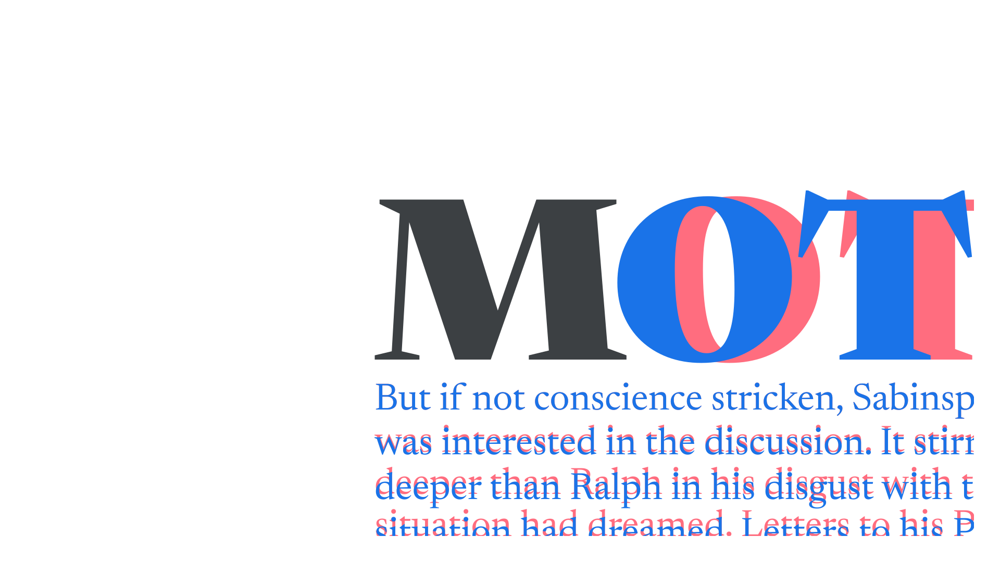

A typographer is someone who designs with type and has a good working knowledge of the practice of [typography](/glossary/typography). A typographer is *not* someone who designs [typefaces](/glossary/typeface)—that’s a [type designer](/glossary/type_designer).

<figure>

</figure>

By reading **Google Fonts Knowledge**, you’re on your way to becoming a skilled typographer.
