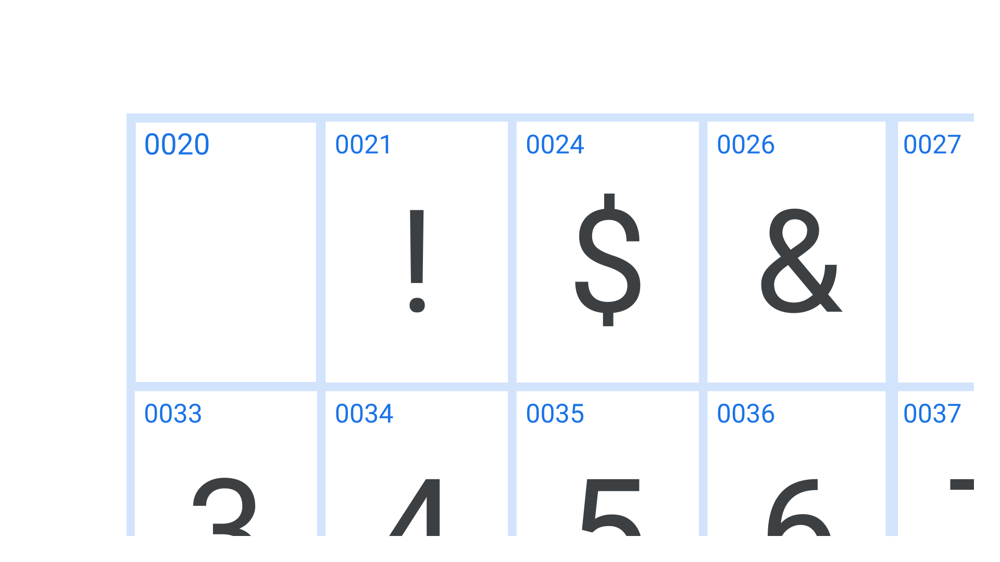

Every single [glyph](/glossary/glyph) in a [font](/glossary/font) has an associated unicode reference: a unique identifier that corresponds with the same [character](/glossary/character) in other [typefaces](/glossary/typeface), regardless of the language.

<figure>

</figure>

Unicode defines which characters exist; any given character will have a default glyph in the font—and perhaps more. For example, a capital A, swash capital A, and small cap A would be three different glyphs, but all options for the same character of “capital A”.

In theory every font can contain a custom set of characters—[numeral](/glossary/numerals_figures)-only fonts are not uncommon—but, in practice, most tend to cover a few well-defined character sets.
