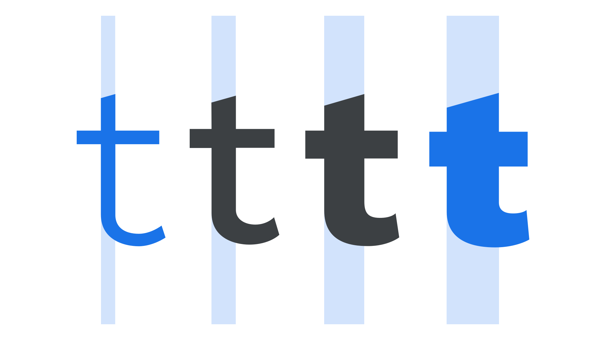

Weight is the overall thickness of a [typeface](/glossary/typeface)’s [stroke](/glossary/stroke) in any given [font](/glossary/font). The most common weights are [regular](/glossary/regular_upright) and [bold](/glossary/bold), but weights can cover extremes from the very light to the very heavy. With the weight [axis](/glossary/axis_in_variable_fonts) in [variable fonts](/glossary/variable_fonts), that number is effectively unlimited.

<figure>

</figure>

Typically, font weights range from hairline and extra light at the lightest (i.e., thinnest) end of the spectrum, all the way to black or ultra at the heaviest (i.e., thickest). Note: the actual naming of individual weights is arbitrary and down to the individual [type designer](/glossary/type_designer) or [type foundry](/glossary/type_foundry).

Although different weights have traditionally been separated out into individual font files, variable fonts allow foundries to distribute all weights in one unified file. Variable fonts have also given freedom to the end user (the designer) to use bespoke weights in between the pre-defined [instances](/glossary/instance) by manipulating a variable font’s weight axis.
