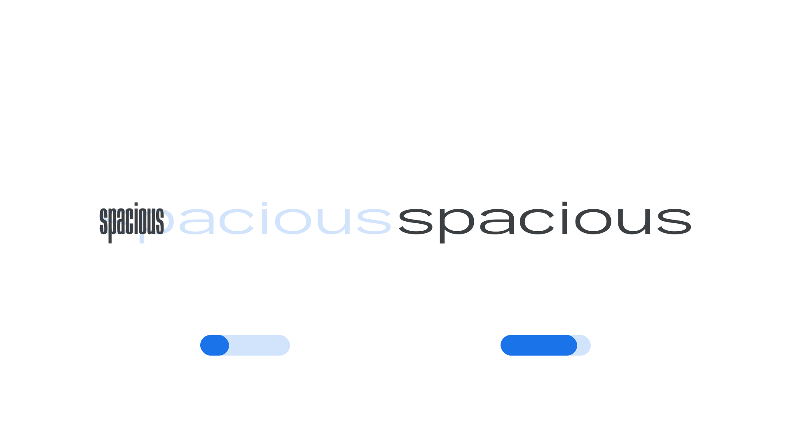

Width (`wdth` in CSS) is an [axis](/glossary/axis_in_variable_fonts) found in some [variable fonts](/glossary/variable_fonts). It controls the [font](INSERT_URL) file’s [width](INSERT_URL).

The [Google Fonts CSS v2 API ](https://developers.google.com/fonts/docs/css2) defines the axis as:

Default: 100     Min: 25     Max: 200     Step: 0.1

<figure>

<figcaption>CAPTION</figcaption>

</figure>

Width is the result of how much horizontal space is taken up by a [typeface](INSERT_URL)’s [characters](INSERT_URL). A [condensed](INSERT_URL) face takes up considerably less space than a [wide](INSERT_URL) one.

In CSS, we can assign a variable width to an element of our choosing using the `font-stretch` property. (Despite the name, note that the type is never literally “stretched” by browsers. This property name was chosen to make the concept more accessible to a general audience.)

<pre>
p {
  font-stretch: 50%;
}
strong {
  font-stretch: 193%;
}
</pre>

Here, our text will be quite narrow—50% is what the type designer has decided is half of the regular (100%) width—and the `strong` text will be almost twice the width of the regular. Width values are always above 0, with 100% being the regular width.
