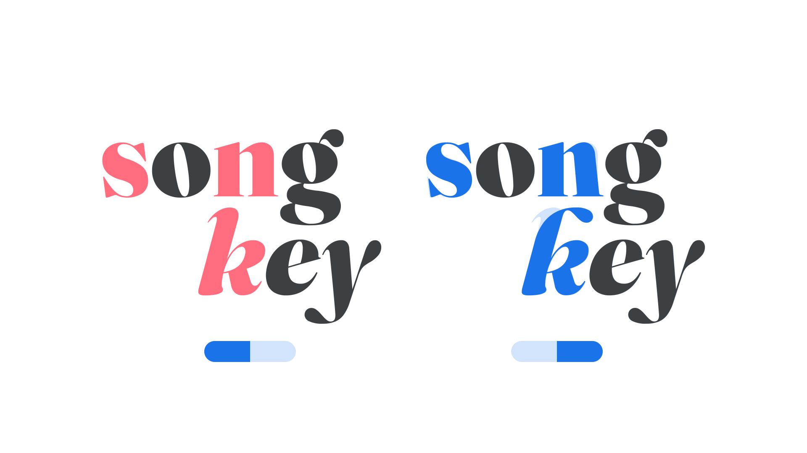

“Wonky” (WONK in CSS)  is an [axis](/glossary/axis_in_variable_fonts) found in some [variable fonts](/glossary/variable_fonts), and, like the italic axis, is binary. It’s used to control the substitution of “wonky” forms.

The [Google Fonts CSS v2 API ](https://developers.google.com/fonts/docs/css2) defines the axis as:

Default: 0     Min: 0     Max: 1     Step: 1

In the Fraunces typeface, setting wonky to “on” (1) introduces the quirkier leaning of the lowercase n/m/h upright characters, or the bulbous flags of the lowercase b/d/h/k/l italic characters. In static fonts, wonky is also available as an OpenType stylistic set.

<figure>

<figcaption>CAPTION</figcaption>

</figure>

In line with the current CSS spec, all custom axes should be referenced in UPPERCASE (only the officially registered variable axes should appear in lowercase). Also, when using the Google Fonts API, the uppercase axes have to appear first in the URL.