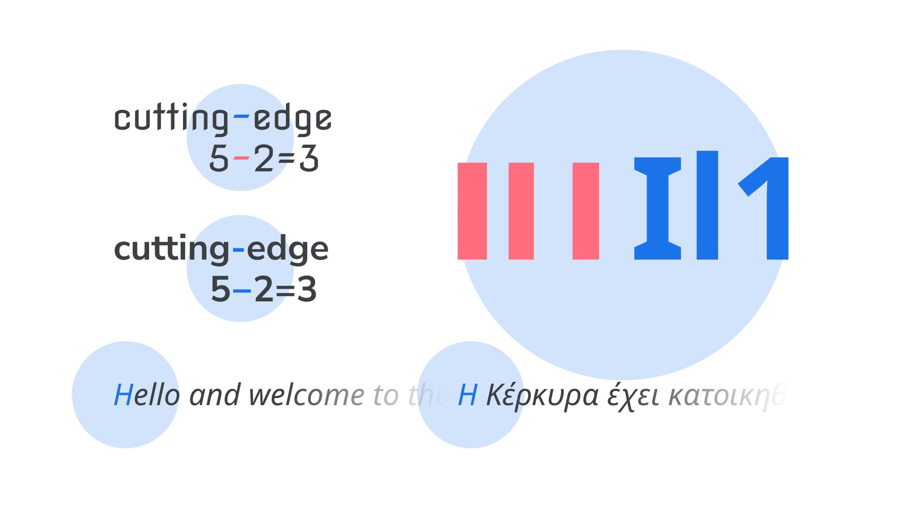

Every article in [our “Choosing type” section](INSERT_URL) aims to be a useful guide on a specific aspect of choosing type. For this article, we’re condensing all of that information into one handy checklist—a checklist that can be referenced every single time we ever need to choose a [typeface](INSERT_URL). Whether you’re selecting the first typeface for a new project, [pairing](INSERT_URL) a secondary typeface after the primary selection has been made, updating a brand with something new that retains the feel of the original, or anything in between, this checklist can act as a universal guide.

We’ll start off with the checklist itself—which is also [available on GitHub](INSERT_URL)—and then spend some time diving into each part of it.

1. The typeface suits the purpose of the project.
1a. Its personality will prompt the appropriate emotional response(s) from the audience.
1b. Its design fits the intended use.
2. The typeface’s design is comprehensive.
2a. It has enough multi-language support.
2b. It contains legible details.
2c. It has at least the basic weights and styles.
2d. Even better: It has alternate glyphs.
2e. Even better: It has additional weights and styles (or grades).
2f. Even better: It has multiple widths.
2g. Even better: It has different optical sizes.
3. The font files are reliable.
3a. All of the design features checked above are actually included in the font files being used.
3b. The fonts are properly spaced.
4. The fonts are usable in the situation(s) required.
4a. If serving as a secondary typeface to a primary choice, there’s a suitable balance between distinction and harmony.
4b. We have, or our client has, the appropriate font license(s).

Let’s explore each item on that list in a little more depth.

## 1. The typeface suits the purpose of the project.

It might sound obvious to say that our choice of typeface should suit the purpose of our project, but there are plenty of examples in the wild of designers using typefaces that just don’t work. So how do we tell what type does and doesn’t work? Let’s pick it apart:

### 1a. Its personality will prompt the appropriate emotional response(s) from our audience.

The emotional response to the shape of [letterforms](INSERT_URL) is a very personal experience; when readers first see type, they react to it in an emotional way before anything else.

<figure>

<figcaption>CAPTION</figcaption>

</figure>

Readers needn’t know anything about type to have an emotive response to it. It’s fair to say that most people have a subliminal awareness of historical and cultural trends in design, of which type has played a part. This means we can use some of these conventions to our advantage—as long as we’re aware of how those associations might differ around the globe and change from audience to audience.
Note that although it can be useful to consider emotive considerations as a way of making an initial selection, be sure to follow the rest of this checklist for the more practical ones.
Comic Sans is perfect for setting children’s activity timetables that are displayed in a school playground. It’s perhaps not as appropriate for announcing scientific breakthroughs.

<figure>

<figcaption>CAPTION</figcaption>

</figure>

Read more in our article “Emotive considerations for choosing typefaces”

### 1b. Its design fits the intended use.

An elaborate [script](INSERT_URL) typeface, full of flourishes and personality, might look great for a brand’s logo, but is unlikely to work well for [body text](INSERT_URL). [Monospaced](INSERT_URL) fonts should probably be the only ones considered for typesetting code. Although we might not be aware of all a typeface’s end uses immediately, there are some we can be mindful of.

<figure>

<figcaption>CAPTION</figcaption>

</figure>

## 2. The typeface’s design is comprehensive.

Before we get into the specifics of actual font files, we need to consider the details in the design of the typeface itself. Has the [type designer](INSERT_URL) provided support for multiple languages, included legible details, and made the minimum [weights](INSERT_URL) and [styles](INSERT_URL) necessary? Beyond that, does the typeface contain [alternate glyphs](INSERT_URL), more weights and styles, different [widths](INSERT_URL), and perhaps even [optical sizes](INSERT_URL)?

Let’s explore each in turn and, for detail, be sure to read our article [“Choosing reliable typefaces”](INSERT_URL)

### 2a. It has enough multi-language support.

There’s no point falling in love with a typeface and using it for a brand if it doesn’t contain that one non-[Latin](INSERT_URL) [character](INSERT_URL) we need for a regional office address in the website’s footer—it’ll get substituted, stand out, and stop the brand from looking professional.

While a small [glyph](INSERT_URL) set might be fine for a logo, it’ll soon fall apart if we try to use such a limited typeface for our main text—especially if we’re working on a digital product that allows for user input, or any website powered by a content management system.

<figure>

<figcaption>CAPTION</figcaption>

</figure>

### 2b. It contains legible details.

To state that type should be legible is obvious, of course. But, even so, in many popular typefaces, [some glyphs are remarkably similar](INSERT_URL). And, because this similarity leads to potential ambiguity over what characters we’re reading, their design can be detrimental to the overall [legibility](INSERT_URL) of text set in these typefaces.

When selecting a typeface—especially a [sans serif](INSERT_URL)—it’s useful to assess the similarities between the uppercase “I”, lowercase “l”, and numeral “1” characters. Because the underlying structure of these letters is very close, it’s up to the type designer to distinguish them from one another.

<figure>

<figcaption>CAPTION</figcaption>

</figure>

### 2c. It has at least the basic weights and styles.

It’s entirely possible for a typeface to be suitable for a project—especially something like a logo—even if it has only one weight. However, to be usable in most scenarios, having a range of weights and styles is preferable. [Regular](INSERT_URL), [italic](INSERT_URL), and [bold](INSERT_URL) (and bold italic) cover the bases, but the more weights a typeface has, the more flexibility is given to the designer. If they’re contained in a variable font, which offers options in between the usual weights and styles, even better.

<figure>

<figcaption>CAPTION</figcaption>

</figure>

Read more in our article [“Introducing weights & styles”](INSERT_URL)

### 2d. [EXTRA] It has alternate glyphs.

The default characters we see in a typeface aren’t necessarily the only options available to us. [Alternate glyphs](INSERT_URL) are often created by type designers to provide a broader palette of typographic possibilities beyond what’s available in the “normal” styles.

While sometimes these are available as separate sibling families, such as Montserrat and Montserrat Alternates, they’re typically made available to us as [OpenType](INSERT_URL) features within a single font file.

There’s so much typographic power to unlock via OpenType if the features exist within the font: From swash characters that add flourish to your [display](INSERT_URL) type, to [fractions](INSERT_URL) that enable legible recipe ingredients; from proper small caps that prevent abbreviations from appearing to shout at the reader, to intentional control over [the different flavors of numerals](INSERT_URL); an understanding of OpenType is arguably one of the greatest tools a designer can have.

<figure>

<figcaption>CAPTION</figcaption>

</figure>

Read more in our articles [“Introducing alternate glyphs”](INSERT_URL) and [“Implementing OpenType features on the web”](INSERT_URL)

### 2e. [EXTRA] It has additional weights and styles (or grades).

With most typefaces offering regular, bold, italic, and bold italic weights and styles, it’s reasonable to ask why we might need yet more variation. Those four are usually enough to convey emphasis and hierarchy, especially when paired with other typographic elements, such as changes in font size.
However, having multiple weights—if not multiple styles—allows far greater flexibility when typesetting large amounts of text, with different typographic elements.

<figure>

<figcaption>CAPTION</figcaption>

</figure>

Read more in our article [“Exploring typefaces with multiple weights or grades”](INSERT_URL)

### 2f. [EXTRA] It has multiple widths.

An often-overlooked variation within a single type family is [width](INSERT_URL). From a [narrow](INSERT_URL) typeface that allows us to fit more words per line, to an [extra wide](INSERT_URL) face that adds personality, multiple widths offer the typographer more ways to work with type without the need to use more than one family.
Like weights, different widths share the typeface’s skeletal structure, meaning that there’s consistency across all widths, even at the extreme ends of the spectrum. Try combining an expanded width for playful titles, a normal width for body text, and a condensed width for headings:

<figure>

<figcaption>CAPTION</figcaption>

</figure>

Read more in our article [“Exploring width in type”](INSERT_URL)

### 2g. [EXTRA] It has different optical sizes.

Optical sizing refers to the practice of type foundries creating slightly different versions of a typeface intended to be used at different sizes. Generally speaking, small (body or caption) optical sizes tend to have less [stroke](INSERT_URL) [contrast](INSERT_URL), larger [x-heights](INSERT_URL), wider characters, and more open spacing. Their large (or [display](INSERT_URL)) counterparts have refined features and tighter spacing—characteristics that would hinder their readability at small sizes.

If a project requires the use of just one typeface, it can be useful to employ different optical sizes for different scenarios, allowing the type to remain consistent across huge billboard ads and tiny website captions, each tweaked to look right in each scenario.

<figure>

<figcaption>CAPTION</figcaption>

</figure>

Some foundries present their different optical sizes with names such as text (or caption), deck, headline, and display — although it’s worth remembering that such finite distinctions are blurred when using variable fonts. A variable font with an optical size axis can offer a smooth range of choices all the way from text to display.

Read more in our article [“Choosing typefaces that have optical sizes”](INSERT_URL)

## 3. The font files are reliable.

Having made a sensible (or adventurous!) typeface choice based on everything above, it’s important to ensure that all of those features are available in the font files we’ll be using — and ensure that all features are consistent across the font family.
3a. All of the design features checked above are actually included in the font files being used.

Even if we know that these features exist, the particular font file we’re using might not necessarily include the glyphs we need.

There are a number of reasons this could be the case, such as a “lite” or non-“pro” version of the font that’s available at a lower price, or perhaps a version that’s coming from a content delivery network over which we have no control. [Web fonts](INSERT_URL) sold directly from a foundry website aren’t necessarily the same versions that appear on font delivery services such as Google Fonts or Adobe Fonts, so double-check the completeness of your font file.

<figure>

<figcaption>CAPTION</figcaption>

</figure>

Read more in our article “OpenType features in practice”

### 3b. The fonts are well-spaced.

While rare, it’s possible to have a font that checks all of our boxes, but lacks decent spacing, which means that it could still look terrible once we start actually setting text with it. Professional fonts should be properly spaced, and they should also contain [kerning pair data](INSERT_URL) that tweaks the spacing between certain glyphs.

<figure>

<figcaption>CAPTION</figcaption>

</figure>

## 4. The fonts are usable in the situation(s) required.

As well as features being technically present in the files, there are a couple more final considerations when it comes to [type pairing](INSERT_URL) and font licensing:

### 4a. If serving as a secondary typeface to a primary choice, there’s a suitable balance between distinction and harmony.
The single biggest challenge we face when pairing type is choosing a secondary typeface that’s different enough from our primary choice, but not too different. Jason Santa Maria, in his book, “On Web Typography,” refers to this as the balance between distinction and harmony:

“[...] you need to choose typefaces that don’t compete too much with each other, but aren’t so similar as to be indistinguishable. [...] When in doubt […] pair a serif and a sans serif. This provides you with what are likely the two most flexible kinds of typefaces, and nearly guarantees you have sufficient variation.”

<figure>

<figcaption>CAPTION</figcaption>

</figure>

In music, harmonious sounds are created by notes with significant separation. Combining notes that are too close results in dissonance—just as with type.

Read more in our article [“Pairing typefaces”](INSERT_URL)

### 4b. We have, or our client has, the appropriate font license(s).

Whether fonts are sold or given away for free, each has an associated [license](INSERT_URL) (and we should have a copy of the license for each font we have a copy of.) When we use a font, that implies we've agreed to those license terms.

We should always check that the end use of our type is covered by the font’s license. There's often a different license required for web fonts to desktop fonts, or even usage in apps and ebooks. The price to license a font for a personal logo may differ from the cost of using it on a news website served to millions of users and it is up to us or our client to confirm the correct usage.

Because price can vary depending on the fonts we choose and their end uses, affordability should also be another constraint to help us narrow our choices.

<figure>

<figcaption>CAPTION</figcaption>

</figure>

Read more in our glossary term [“Licensing”](INSERT_URL)
