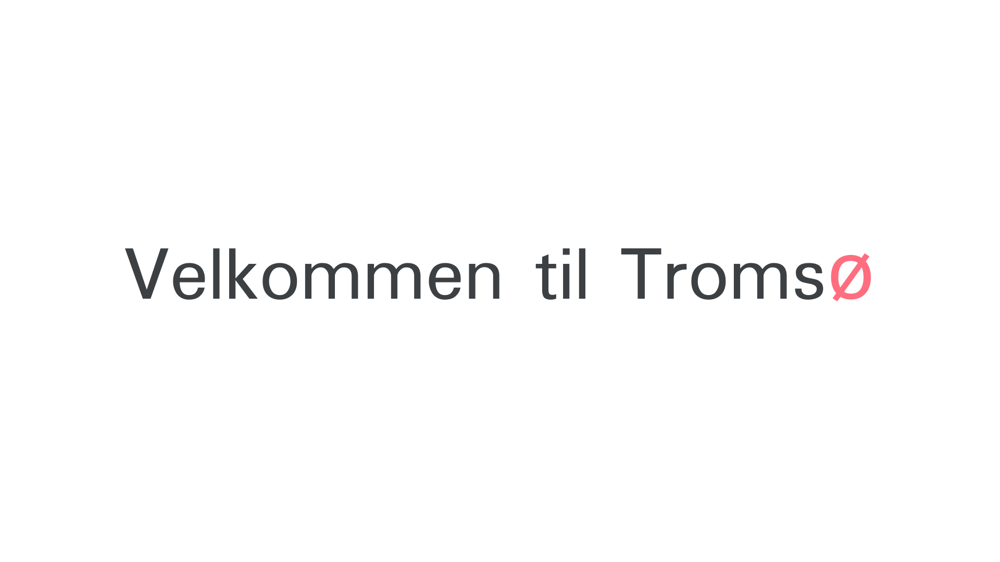
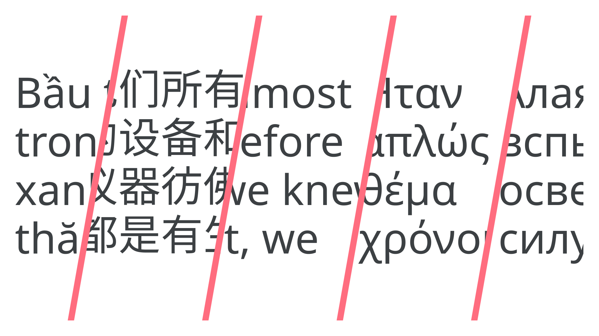
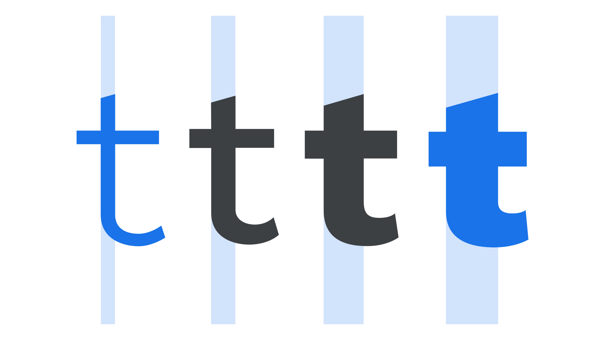
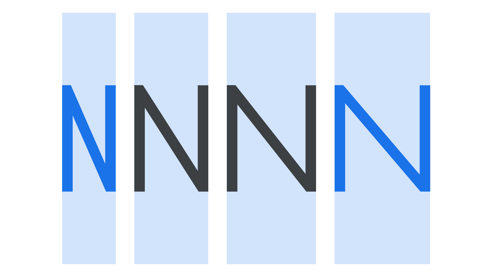

In our [previous article](/lesson/emotive_considerations_for_choosing_typefaces) we looked at the emotive considerations—how [typefaces](/glossary/typeface) make us feel—but warned that the technical considerations should be taken into account as soon as possible when choosing [type](/glossary/type). The rest of this module contains articles that could be grouped as “technical considerations,” and in this article in particular, we’re going to look at how those considerations make a typeface truly reliable or not.

Ideally, a reliable typeface should include:

- Language support
- Legible details
- Multiple weights and styles
- Alternate characters and other OpenType features.

Let’s explore each in turn:

## Language support

There’s no point falling in love with a typeface and using it for a brand if it doesn’t contain that one non-Latin [character](/glossary/character) we need for a regional office address in the website’s footer—it’ll get substituted, stand out, and stop the brand from looking professional.

<figure>

</figure>

While a small [glyph](/glossary/glyph) set might be fine for a logo, it’ll soon fall apart if we try and use such a limited typeface for our main [text](/glossary/text_copy)—especially if we’re working on a digital product that allows for user input, or any website powered by a content management system (i.e., most).

When working with a language that uses [Latin script](/glossary/latin), such as English, be sure to use a typeface that at least has support for western European languages, but also ideally support for central, eastern European, Vietnamese and African languages, too. It’s all too easy for us to forget the needs of users working with a different language—or a different script entirely.

<figure>

</figure>

For multinationals, where the brand identity will need to travel not just between different languages, but also between different scripts or writing systems, we should consider typefaces or [type families](/glossary/family_or_type_family_or_font_family) that cater to this—although they are less common.

The [Noto fonts](https://fonts.google.com/noto) are an effort to enable harmonious, aesthetic, and typographically correct global communication, in more than 1,000 languages and over 150 writing systems.

## Legible details

To state that type should be [legible](/glossary/legibility_readability) is obvious, of course. But, even so, in many regarded and well-known typefaces, some glyphs are remarkably similar (these are sometimes called *homoglyphs).* And, because this similarity leads to potential ambiguity over what characters we’re reading, their design can be detrimental to the overall legibility of [text](/glossary/text_copy) set in these typefaces.

When selecting a typeface—especially a [sans serif](/glossary/sans_serif)—it’s useful to assess the similarities between the [uppercase](/glossary/uppercase_lowercase) “I”, lowercase “l”, and [numeral](/glossary/numerals_figures) “1” characters. Because the underlying structure of these letters is very close, it’s up to the type designer to distinguish them adequately from one another.

<figure>

</figure>

Why do these details matter? Imagine missing your flight because it wasn’t clear whether you should proceed to Gate I or Gate 1. Even if a reader is able to work out which character they’re reading, just a pause in the reading experience can lead to [cognitive dissonance](https://g.co/kgs/jsi25f).

[//]: # (For more information, please see our article “Applying UX psychology when pairing typefaces”.)

## Multiple weights and styles (and widths, and optical sizes...)

It’s entirely possible for a typeface to be suitable for a project—especially something like a logo—even if it has only one [weight](/glossary/weight). However, to be usable in most scenarios, having a range of weights and styles is preferable. [Regular](/glossary/regular_upright), [italic](/glossary/italic), [bold](/glossary/bold), and bold italic cover the bases, but the more weights (and/or [grades](/lesson/exploring_typefaces_with_multiple_weights_or_grades)) a typeface has, the more flexibility is given to the designer. And if those weights are accessible via the weight [axis](/glossary/axis_in_variable_fonts) in a [variable font](/glossary/variable_fonts), even better.

When we talk about styles, we usually think of italic forms. However, [small caps](/glossary/small_caps) are also a kind of style, and having them present in the type offers even more options. (Until the mid 20th century, small caps were often considered more essential than bold fonts.)

<figure>

</figure>

Let’s not stop there! Multiple [widths](/glossary/width) and [optical sizes](/glossary/optical_sizes) allow for even finer control over our [typesetting](/glossary/typesetting), and often negate the need for a [secondary typeface](/lesson/pairing_typefaces).

<figure>

</figure>

We go into all of these benefits in our dedicated articles on the subjects:

- [“Exploring typefaces with multiple weights or grades”](/lesson/exploring_typefaces_with_multiple_weights_or_grades)
- [“Exploring width in type”](/lesson/exploring_width_in_type)
- [“Choosing typefaces that have optical sizes”](/lesson/choosing_typefaces_that_have_optical_sizes)

And, as so many of these features can be manipulated with [variable fonts](/glossary/variable_fonts), be sure to read [“Introducing variable fonts.”](/lesson/introducing_variable_fonts)

## Alternate characters and other OpenType features

Multiple versions of characters (accessed via [OpenType](/glossary/open_type)) help make a typeface more robust. Some of those can certainly be [legibility and readability](/glossary/legibility_readability) aids, such as [ligatures](/glossary/ligature), [contextual alternates](/glossary/alternates), the aforementioned small caps, [fractions](/glossary/fractions), and different numeral forms; others can be purely aesthetic, such as [swashes](/glossary/swash_glyph), or [stylistic sets](/glossary/stylistic_sets). And let’s not forget [kerning](/glossary/kerning_kerning_pairs)! A well-spaced font file, with thorough kerning-pair data built in, is often what can separate good fonts from bad fonts.

<figure>

</figure>

We explore OpenType in more depth in our article [“OpenType features in practice.”](/lesson/open_type_features_in_practice)

Thanks to the work of professional [type designers](/glossary/type_designer), who often invest years of work in creating truly robust typefaces, many of the fonts we have at our disposal offer us a great deal of versatility. Understanding all that can potentially be found in a typeface lets us properly assess how reliable (or unreliable) they can be for our projects.
