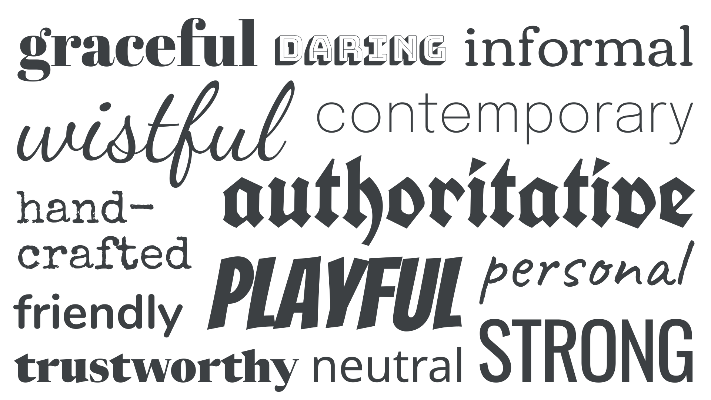
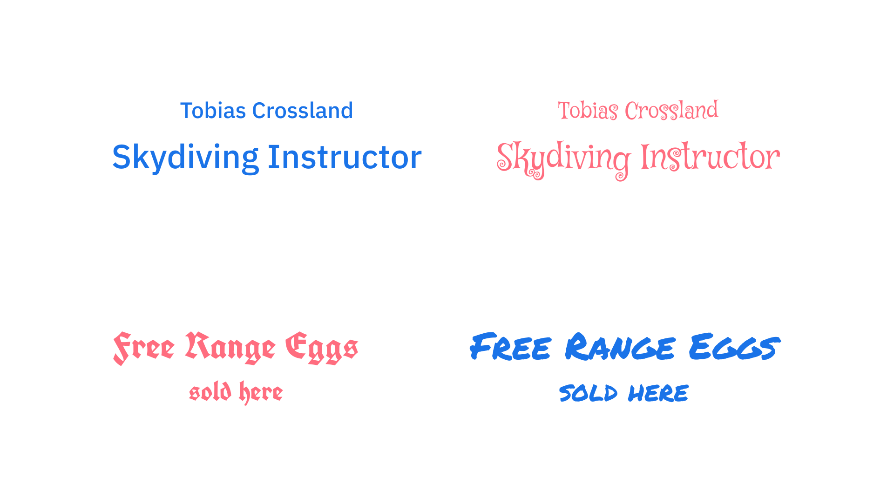
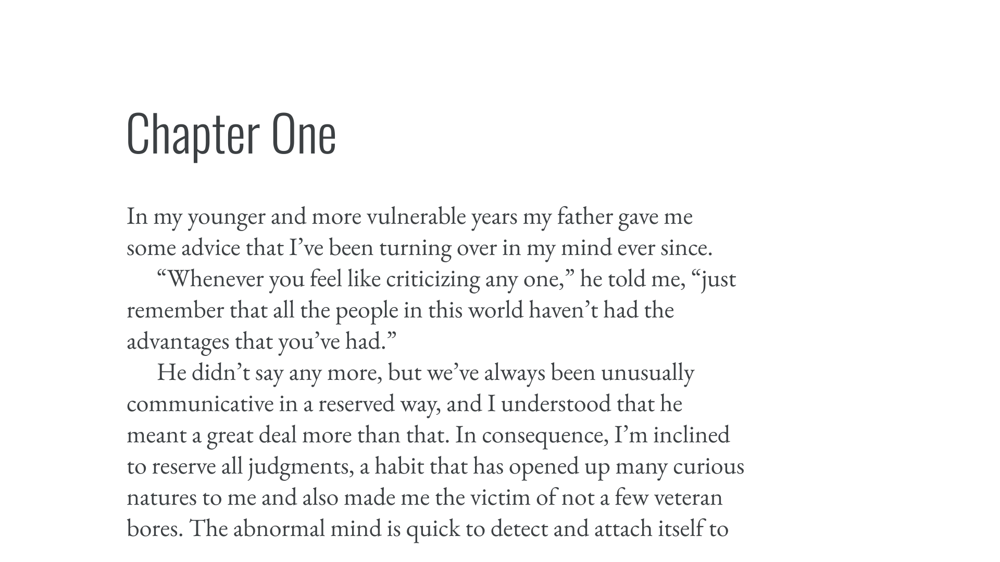
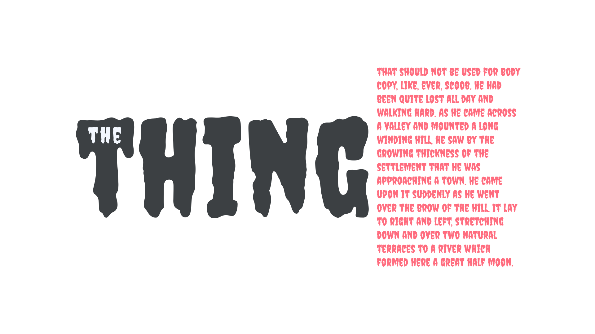
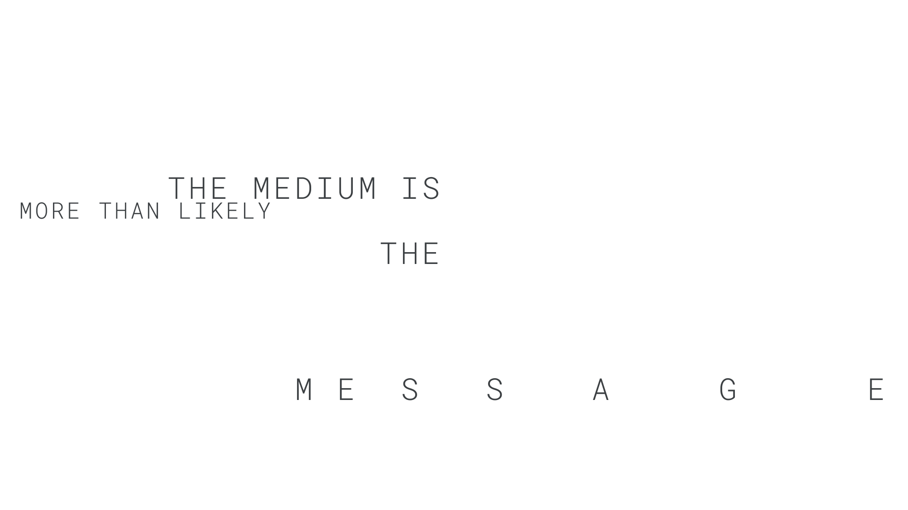

When choosing [typefaces](/glossary/typeface), there are two key considerations: How does this [type](/glossary/type) make us *feel* and how does this type *work?* The emotional response to the shape of [letterforms](/glossary/letterform) is a very personal experience, and when readers first see type, they react to it in an emotional way before anything else. It’s a major part of why so much emphasis is placed on choosing type even when it’s not technically a part of [typography](/glossary/typography).

So, for this article, we’ll explore the emotive considerations that come into play, before moving onto articles that deal with the technical considerations of choosing type.

<figure>

</figure>

But first: A warning! Selecting a typeface based on the emotional reactions it stirs in us and our readers is perfectly valid, but it’s important to not base our decisions on them alone. By all means use emotive considerations as a way of making an initial selection, but be sure to quickly analyze against technical suitability—there’s no point in choosing something that feels perfect if it [only has one weight, or lacks character support for a language we need to cover](/lesson/choosing_reliable_typefaces).

In his book, "Stop Stealing Sheep and Find Out How Type Works," Erik Spiekermann shows a few examples of type set in appropriate typefaces that invoke either trust or distrust from the reader:

<figure>

<figcaption>Which one would you trust? In this reimagining of an illustration from Erik Spiekermann’s "Stop Stealing Sheep...," it’s likely we’d place more faith in the skydiving instructor who uses the sans serif type. Conversely, we’d probably prefer our egg seller to be a bit more casual.</figcaption>

</figure>

And it’s not just about trust. It’s important to remember that readers needn’t know anything about type to have an emotive response to it. It’s fair to say that most people have at least some awareness of general cultural and design trends of which type has played a part, and this means we can use some of these shared cultural conventions to our advantage—as long as we’re aware of how those associations might differ around the globe, and change from audience to audience. These associations can change over time, too: Just a few years ago, calligraphic faces usually evoked a 70s or 80s design aesthetic, but today are enjoying a resurgence.

It’s our job as [typographers](/glossary/typographer)—as people who *do* know about type—to help guide our audience by invoking the most appropriate emotional response.

For an interactive example, Adobe Fonts created a light-hearted game with type educator Sarah Hyndman to explore some of the traits associated with certain typefaces. You can play the game online at [game.fonts.adobe.com](https://game.fonts.adobe.com/).

[//]: # (1st content drop: This would actually be a great place to get Sarah Hyndman to share on overview of her work in this area, which could be used as a key summary on emotive responses to type.)

Although most readers are unlikely to have a detailed knowledge of typographic history, the shared cultural understanding they bring to type is frequently based on history: Type can often evoke a feeling from a certain era, from [blackletter](/glossary/blackletter) type that depicts medieval contexts, to curvacious, bell-bottomed display faces that instantly conjure the feel of the 1970s.

In her article, [“Upping Your Type Game,”](https://www.jessicahische.is/talkingtype) Jessica Hische talks about the historical accuracy of type, which we explore in more detail in our article [“Making sense of typographic classifications.”](/lesson/making_sense_of_typographic_classifications) She also addresses type without immediate cultural associations, which “can definitely evoke a feeling and a backstory, you just have to spend enough time with it to let that story materialize.”

<figure>

<figcaption>Heading text and paragraph text set in typefaces that are from the same historical period.</figcaption>

</figure>

There’s a huge temptation to focus on how letterforms make us feel, but it’s important to consider how the text feels as a whole—as a collection of words—rather than looking at just individual characters, or even individual words. As Matthew Carter famously said, “Type is a beautiful group of letters, not a group of beautiful letters.”

In scenarios like the illustration below, a more neutral and readable body typeface could be paired with the evocative heading typeface:

<figure>

<figcaption>This typeface works great for display type, but is virtually unreadable when used for body text.</figcaption>

</figure>

Lastly, let’s consider the work of David Carson, a designer known for challenging design norms in the 1990s. In most cases, it’s not the typefaces he chooses to work with that evoke an emotive response, it’s the way he uses spacing and juxtaposition; he breaks the supposed rules of good typography to create a *feeling.*

<figure>

<figcaption>An intentionally disjointed reading experience, set in the style of David Carson.</figcaption>

</figure>

David Carson is known for saying, “Don’t mistake legibility for communication.” In other words, legible letterforms don’t convey meaning by themselves, their arrangement contributes to the message being conveyed. Whether his style is one we love or hate, it’s important for us to remember that typography is not technically about choosing typefaces—it is, in fact, their arrangement.
