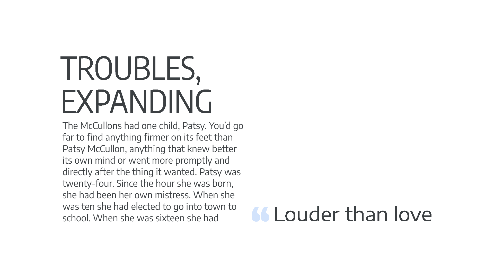
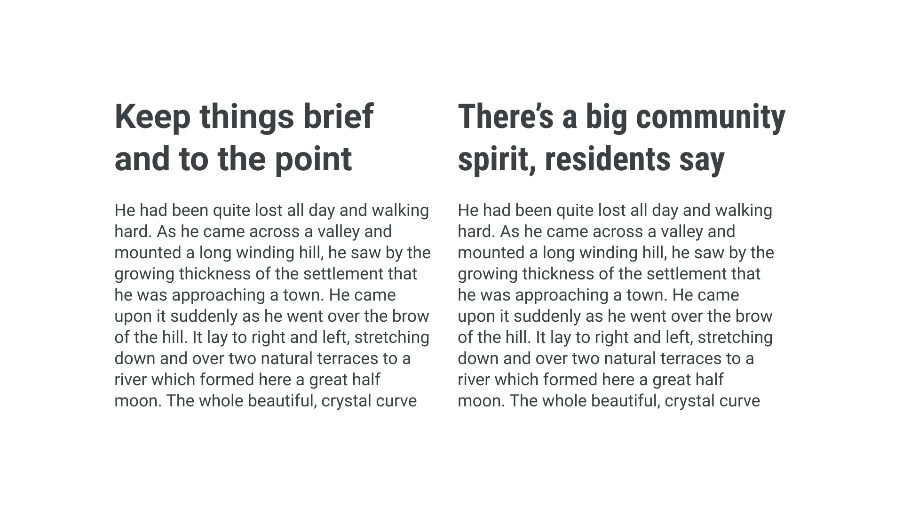

With multiple [weights](/glossary/weight) and [styles](/glossary/style) and [optical sizes](/glossary/optical_sizes) and [style sets](/glossary/stylistic_sets), there’s so much opportunity for variation given to us when using [type](/glossary/type) (especially when many of those are baked into one font file as with [variable fonts](/glossary/variable_fonts)).

An often-overlooked variation within a single [type family](/glossary/family_or_type_family_or_font_family) is [width](/glossary/width). From a narrow typeface that allows us to fit more words per line, to a fat face that screams personality, multiple widths offer the [typographer](/glossary/typographer) more ways to work with type [without the need to use more than one typeface](/lesson/pairing_typefaces).

<figure>

</figure>

Like weights, different widths share the typeface’s skeletal structure, meaning that there’s consistency across all widths, even at the extreme ends of the spectrum. Try combining an extra condensed width for playful headings, a normal width for body text, and a wide width for small pull quotes.

<figure>

</figure>

Or how about using multiple widths to set headings of different lengths at the same size to simplify the layout process? Headings with very few words can be set in a wide variant, and headings with lots of words in an extra condensed variant.

<figure>

</figure>

With typographic treatments like these, it’s easy to see how—when combined with a few choice weights—a robust typographic system could start to take shape.

[//]: # (above, link to “typographic system” when article is live.)

## Variable width

With variable fonts, the [type designer](/glossary/type_designer) can choose to offer an [axis](/glossary/axis_in_variable_fonts) for width much in the same way they might offer one for weight. Therefore, it’s now possible for us as typographers to have a very granular level of control over exactly how narrow or wide our type appears—without having to choose from limited and preconceived points on that scale, as we have traditionally.

This can be particularly useful, for instance, when stacking type in social media stories. Their vertical nature makes the possibility to fit each word to an exact width very appealing.

<figure>

<figcaption>
A subtly different width value is used for each line so that they appear perfectly left- and right-aligned.
</figcaption>

</figure>

## A note on naming conventions

Much like weights, the names of different widths are arbitrary and down to the personal preferences of the type designer or [type foundry](/glossary/type_foundry). Typically, slightly narrow widths are referred to as either “narrow” or “condensed;” the narrower they get, the more likely they are to be called either “extra condensed” or “compressed.” At the other end of the scale, we have wider faces often being called “wide,” “extra wide,” or “extended.”

Bold fonts are typically designed to be somewhat wider than light fonts—otherwise they tend to look rather cramped. Sometimes, there’s a need for a typeface whose weight variations are all exactly the same width, allowing us to change the weight without causing the text to reflow. Such fonts are called [“multiplexed” or “duplexed” or “uniwidth”](/glossary/multiplexed_duplexed_uniwidth). Process Type’s [Recent Grotesk](https://processtypefoundry.com/fonts/recent-grotesk/try-it) typeface challenges that notion by embracing the opposite: The heavier the weight, the wider the width; the lighter the weight, the narrower the width.
