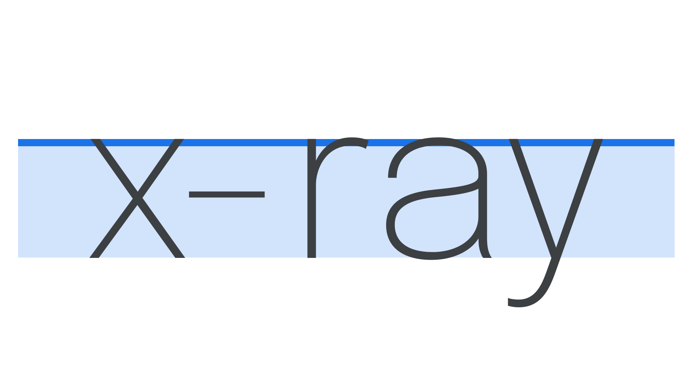

When we swap fonts, or we introduce another font, there’s very often a slight change in layout. Although it can be subtle, it’s disruptive enough to cause some big issues for our designs, especially further down the line. Let’s explore what’s going on there.

To start, it’s important to know that, when [typefaces](/glossary/typeface) are designed, the [letterforms](/glossary/letterform) adhere to a number of measurements called vertical metrics, which sit inside a box called an [em square](/glossary/em). In [Latin](/glossary/latin) [type](/glossary/type), the line where [ascenders](/glossary/ascenders_descenders) reach is usually the top-most measurement, followed very closely by [cap height](/glossary/cap_height) (although occasionally these two lines are the same). The next one down is the [x-height](/glossary/x_height), followed by the [baseline](/glossary/baseline), and then the [descender](/glossary/ascenders_descenders) line at the lowest point.

In this article, we’ll focus on the x-height—the height of a typeface’s [lowercase](/glossary/uppercase_lowercase) [letterforms](/glossary/letterform) relative to the em square—and look at how it relates to the em square when considering [type pairings](/topic/pairing_type).

<figure>

</figure>

X-height is an important factor in [readability](/glossary/legibility_readability) because, at any given [font](/glossary/font) size, it determines how large or small the typeface actually looks. Put simply: When the x-height is large, the typeface will probably be easier to read at small sizes.

The term itself was established because the height of each lowercase letter varies slightly, and the flat edges at the top and bottom of the x character make it a good representative for the typical height of *all* lowercase letters. As x-heights become taller, white space is redistributed from outside the letters to inside letters (e.g. the counters become larger). To offset or balance this redistribution of white space, it’s usually a good idea to increase the [line height](/glossary/line_height_leading).

X-heights vary between typefaces, causing some typefaces to appear larger or smaller than others when typed, even though the actual font size remains the same. This might not always matter—especially for headline or [display](/glossary/display) type—but even just changing fonts in a word processor makes it immediately clear how some words and whole lines can shift to different points on the page.

<figure>

<figcaption>The typeface on the right has a slightly smaller x-height, and also considerably lower descenders.</figcaption>

</figure>

<figure>

<figcaption>Note how the example on the right appears significantly smaller than the one on the left, despite them being set at the exact same font size and with the same line height values.</figcaption>

</figure>

The effect can be even more obvious and potentially disruptive in other circumstances. We might notice that when we swap out one typeface for another at the same font size, the new one doesn’t necessarily sit in the same vertical position. If we’re updating brand guidelines, or a user interface, such a change in alignment could unbalance a button design on a website or app, or, worse, break the alignment throughout an entire design system. It’s also a consideration if we decide to use two typefaces next to each other, as we might if we use a [secondary typeface](/lesson/pairing_typefaces) in place of a bold weight.

<figure>

<figcaption>Note how when the typeface is changed for the citation in the second example, the type no longer sits correctly on the same baseline grid, even with unchanged font-size and line height values.</figcaption>

</figure>

Why is this happening, exactly? The answer is in the [em](/glossary/em) square: The transparent canvas on which each [glyph](/glossary/glyph) is drawn and which was originally based on the proportions of an uppercase “M” character. It’s also sometimes called the “glyph space” or “em size” and is a [cartesian grid space,](https://en.wikipedia.org/wiki/Cartesian_coordinate_system) with an origin on the left edge that creates the baseline. The top and bottom edges are called the ascent and descent, and the coarseness of its grid or “units per em” (UPM) is typically 1000, with an ascent 800 units up and the descent 200 units below.

And while the em square *is* a containing structure—and very much adhered to by [monospaced](/glossary/monospaced) typefaces—parts of some letters can actually go outside of that block, such as a [swash](/glossary/swash_glyph).

<figure>

</figure>

When we set the font size (e.g. 14px), what we’re *actually* doing is setting the size the em square is scaled to. And although the font size set by us designers tells the software at which size to render the em square, the type design *within* that em square can theoretically sit wherever the [type designer](/glossary/type_designer) wants it to. The horizontal and vertical positions of the marks that make up any given [letterform](/glossary/letterform) are very much an arbitrary decision, so, like many things in type and typography, there are no hard-and-fast rules.

<figure>

<figcaption>Despite these typefaces being set at the exact same font-size, the one on the left appears to be dramatically “bigger” thanks to its large x-height and short ascenders and descenders. Long ascenders and descenders, as shown in the right, don’t contribute to the overall perceived size—although they do require more generous line height settings.</figcaption>

</figure>

This internal positioning is the reason that some typefaces can sometimes appear bigger than others: Their letterforms take up more physical space inside their em squares. If a typeface has a larger x-height—i.e., it appears to have shorter capitals, ascenders, and descenders—it’s got more of that top and bottom space it can fill.

And even for typefaces with the same (or very similar) values for their x-heights, if their baselines don’t sit at the same position within the em square, they can still appear vertically mismatched when set next to each other.

<figure>

<figcaption>Some type sits in a very different position within the em square.</figcaption>

</figure>

So, as [designers working with type](/glossary/typographer), it’s important to be aware of the inconsistencies that naturally exist within type design and font production. This knowledge helps not only with choosing and pairing typefaces, but also with tweaking our designs in the future. Ultimately, metrics offer guidance, but we should trust our eyes and do what feels right for our designs.
