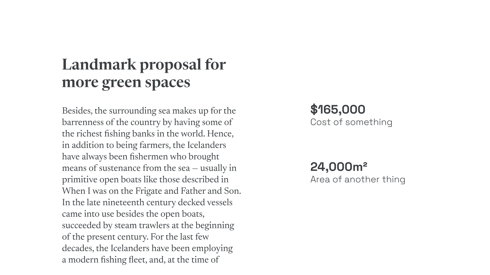
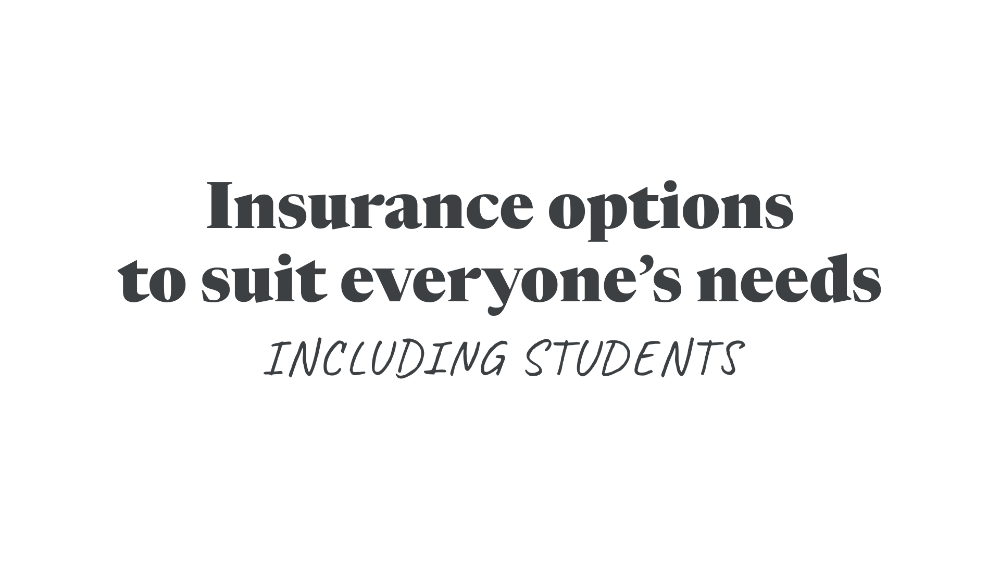
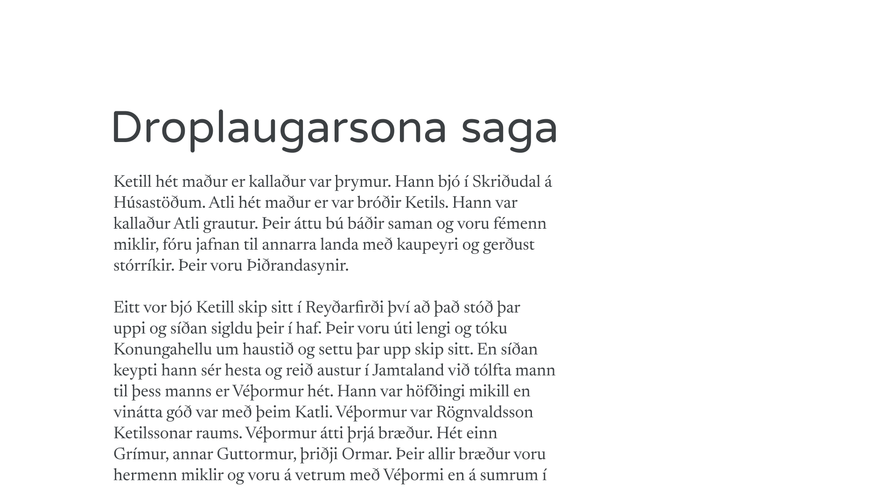
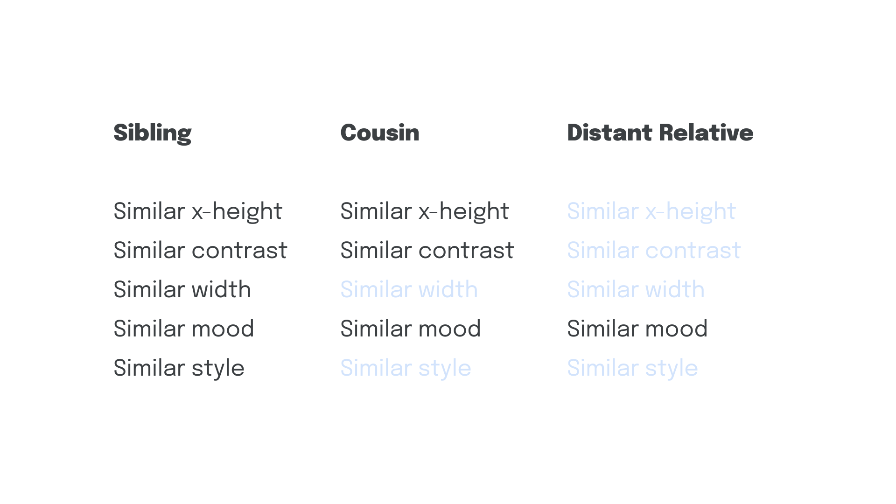
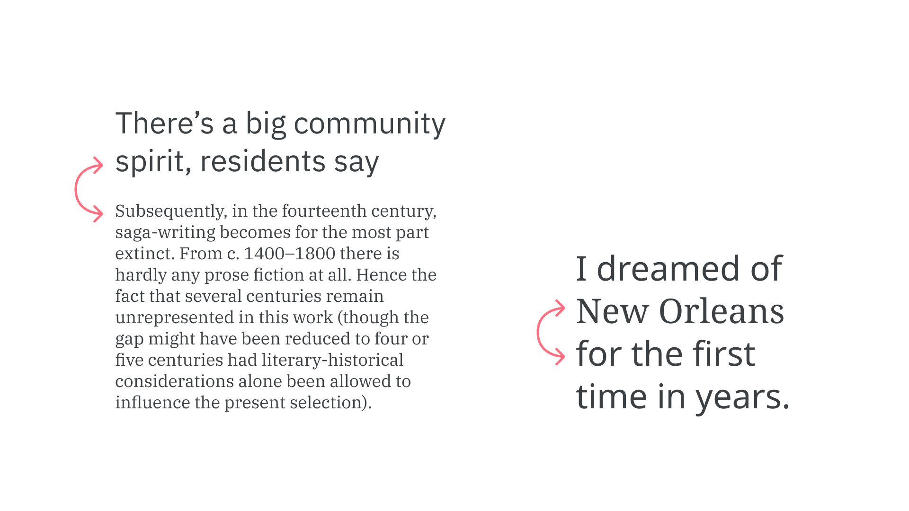

Once we’ve spent all that time and effort choosing a primary [typeface](/glossary/typeface) for our project, we get to do it all over again for a *secondary* typeface.

With so much great [type](/glossary/type) out there, it’s very tempting to use it all. But first, a quick reality check: Do we really need a secondary typeface? Have we explored all of the possibilities on offer in our primary one, such as the various [weights](/glossary/weight), [styles](/glossary/style), [widths](/glossary/width), and [optical sizes](/glossary/optical_sizes)? Even typefaces that contain just one [font](/glossary/font) can be adjusted—with [size](/glossary/point_size), [case](/glossary/uppercase_lowercase), and [tracking](/glossary/tracking_letter_spacing) values—to create contrast in our [text](/glossary/text_copy).

Let’s look at some scenarios where the answer to the question “do we really need a secondary typeface?” is a definite “yes:”

## 1. Changing context

If we need to display data alongside editorial text, or perhaps set an aside or footnote, we might benefit from employing a secondary typeface that’s notably different—perhaps even notably different in tone.

<figure>

</figure>

## 2. Augmenting a brand’s personality

When the brand’s primary typeface is too serious, it may need combining with a more friendly typeface to more accurately capture the accessible feel of a brand.

<figure>

</figure>

## 3. Adding additional weights, widths, or styles

It could be that the primary typeface doesn’t offer enough variation, perhaps being limited in the number of weights, widths, or styles—which could be as simple as not having a different weight to use as a heading. Some typefaces don’t have italics, so rather than have italic text rendered as a [faux italic](/glossary/faux_fake_pseudo_synthesized), we could choose a secondary typeface to use instead.

<figure>

<figcaption>Although the x-height doesn’t match, note how the lavish ascenders and descenders makes up for it, and the stroke weight appears approximately the same.</figcaption>

</figure>

## 4. Accounting for missing features

If our primary character is missing features, such as support for international characters, a secondary typeface can be used in body copy, where encountering these characters is most likely.

<figure>

</figure>

In all circumstances, it’s valid to employ a secondary typeface if we need it to do things that our primary typeface cannot.

Jessica Hische, in her article [“Upping Your Type Game,”](https://www.jessicahische.is/talkingtype) suggests we pair typefaces by considering their relationship to each other as relatives in a family. (Not a [family in the *typographic* sense](/glossary/family_or_type_family_or_font_family) of the word, but one we’re perhaps more accustomed to: Siblings, cousins, distant relatives, etc.) While the type pairings could indeed be from the same *literal* typeface family, Jessica suggests we look for similarities across seemingly unrelated typefaces that might tie them together:

<figure>

</figure>

A “sibling” typeface in this example might have a similar [x-height](/glossary/x_height), similar [contrast](/glossary/contrast), similar width, and may even share similarities in some of the more abstract traits of a superfamily, such as similar mood and similar style, whereas a cousin may only possess two or three of those shared properties. A distant relative might only have *one* connecting factor, but depending on what that factor is and what we’re setting out to do, it might be enough to justify the pairing.

We should also be aware of the implications of combining typefaces that might come from different historical periods—a consideration we explore in our article [“Emotive considerations for choosing typefaces.”](/lesson/emotive_considerations_for_choosing_typefaces)

The single biggest challenge we face when pairing type is choosing a secondary typeface that’s different enough from our primary choice, but not *too* different. Jason Santa Maria, in his book, “On Web Typography,” refers to this as the balance between distinction and harmony:

> [...] you need to choose typefaces that don’t compete too much with each other, but aren’t so similar as to be indistinguishable. [...] When in doubt […] pair a serif and a sans serif. This provides you with what are likely the two most flexible kinds of typefaces, and nearly guarantees you have sufficient variation.
>

In music, harmonious sounds are created by notes with significant separation. Combining notes that are too close results in dissonance—just as with type.

<figure>

</figure>

While pairing typefaces usually refers to the combination of two, the same logic and analysis should apply whether we’re combining two, three, four, or more typefaces in a project. And again, we must always check whether it’s absolutely necessary to add more.

### External resources:

- [*On Web Typography* by Jason Santa Maria](https://abookapart.com/products/on-web-typography)
- [*Upping Your Type Game* by Jessica Hische](https://www.jessicahische.is/talkingtype)
- *Stop stealing sheep and find out how type works* by Erik Spiekermann
- *Combining Typefaces* by Tim Brown
