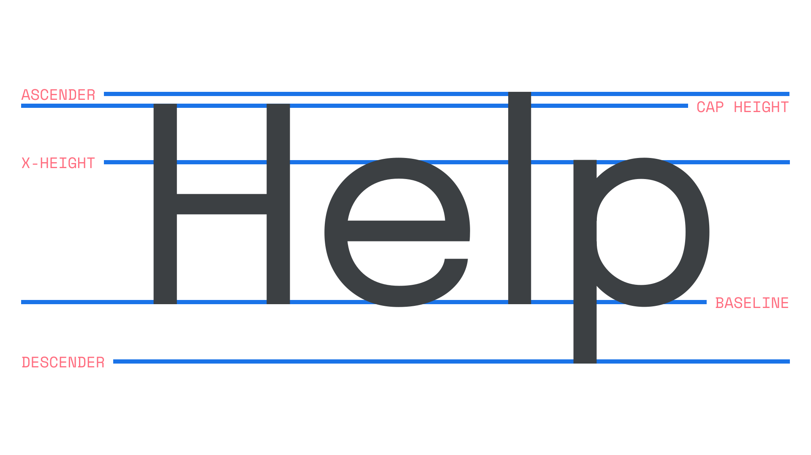
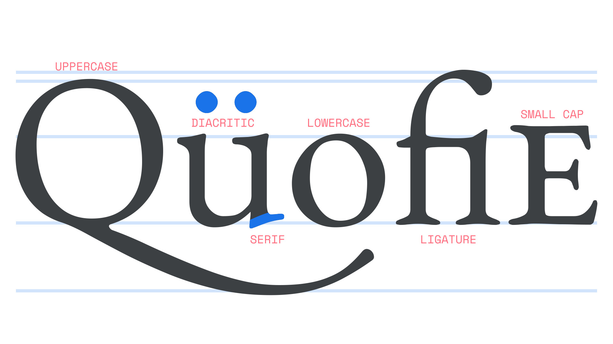
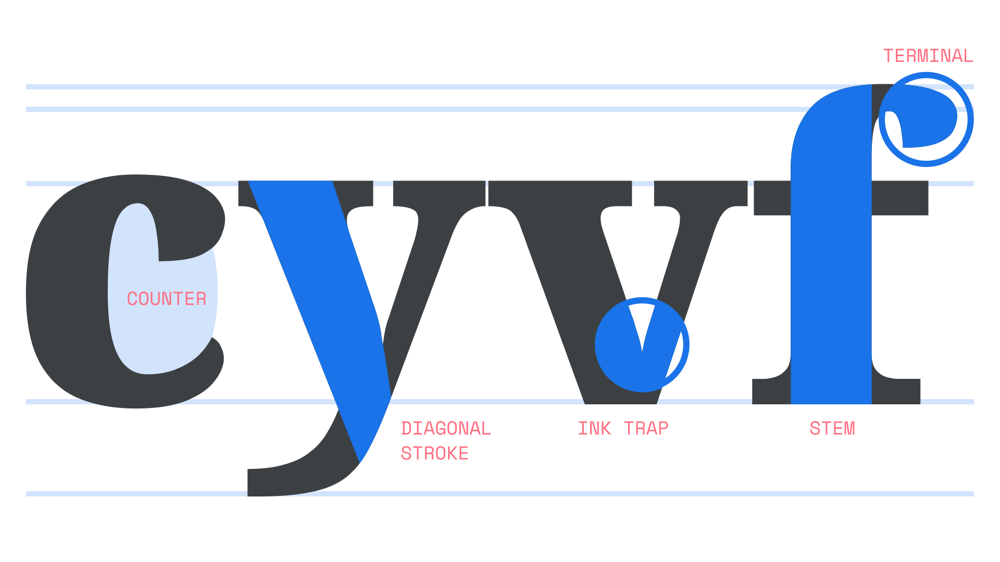

When talking about type, it’s useful to have some familiarity with the terminology used to describe the different parts of a typeface’s design. Although it’s true that some terms are very specific, and might only seem relevant when discussing certain parts of a letter (shoulder, spine, foot, etc.), many are essential when we consider typography as a whole, such as the vertical proportions (x-height, baseline, and cap height), or shapes that influence further typographic adjustments (ascenders, descenders, small caps, etc).

<figure>

<figcaption>CAPTION</figcaption>

</figure>

We often discuss vertical proportions (or vertical metrics) when talking about optimal typesetting. In multiple lines of text, one of the most important roles played by an appropriate line height is to ensure that there’s no clash between descenders in one line and ascenders in the following line. The varying proportions in different typefaces — and in particular their x-heights — can cause type to appear larger or smaller than others, even when the font size isn’t changed.

<figure>

<figcaption>CAPTION</figcaption>

</figure>

The Latin script has two cases, which means that each letter has an uppercase and lowercase form. Some common building blocks of characters include varying flavors of diacritics or accent marks, commonly used in Latin alphabets other than English (although they do appear in some loan words, such as “café” or “naïve”). Serifs are the marks or lines that can appear at the end of a character’s stroke, and lend their name to the collective name for typefaces that use serifs in their design. A ligature is a glyph that combines the shapes of certain sequences of characters into a new form that can make for a more harmonious reading experience. As in the illustration, the character sequence of “f” and “i” is often replaced with a “fi” ligature. Small caps are uppercase letterforms with their proportions adjusted for setting within lowercase type, used for acronyms, single words, or a few words at the start of a chapter.

<figure>

<figcaption>CAPTION</figcaption>

</figure>

There are many elements that make up whole letterforms. A counter refers to the opening of a round letterform such as a “c”. A diagonal stroke is quite literally a diagonal stroke, found on characters such as “y”, “v”, and “k”. Ink traps are exaggerated incisions where strokes join, intended to lighten parts that would otherwise look too heavy. With the evolution of print technology and on-screen use of type, ink traps in modern typefaces often serve a more stylistic purpose rather than their traditional intent of trapping ink, although they do still make corners look sharper. Bold fonts at small sizes benefit especially, and at large sizes the effect makes for a distinctive stylistic choice. A stem is a letterform’s main vertical stroke. A terminal refers to the ending of the stroke. The way a type designer treats terminals is a key factor in the overall typeface design, and has significant effects on legibility as well as stylistic expression.