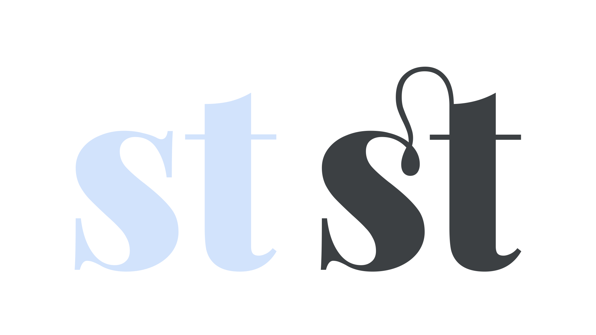
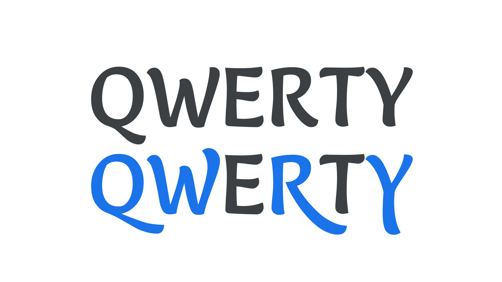
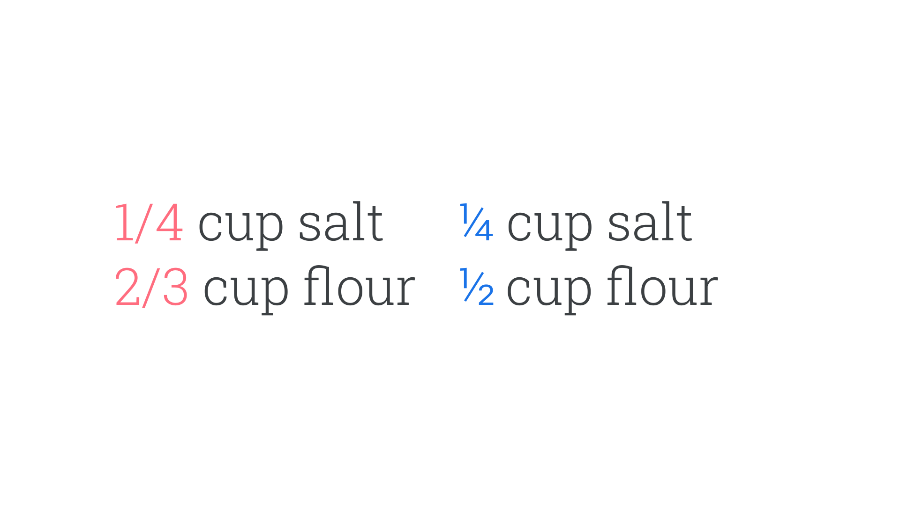
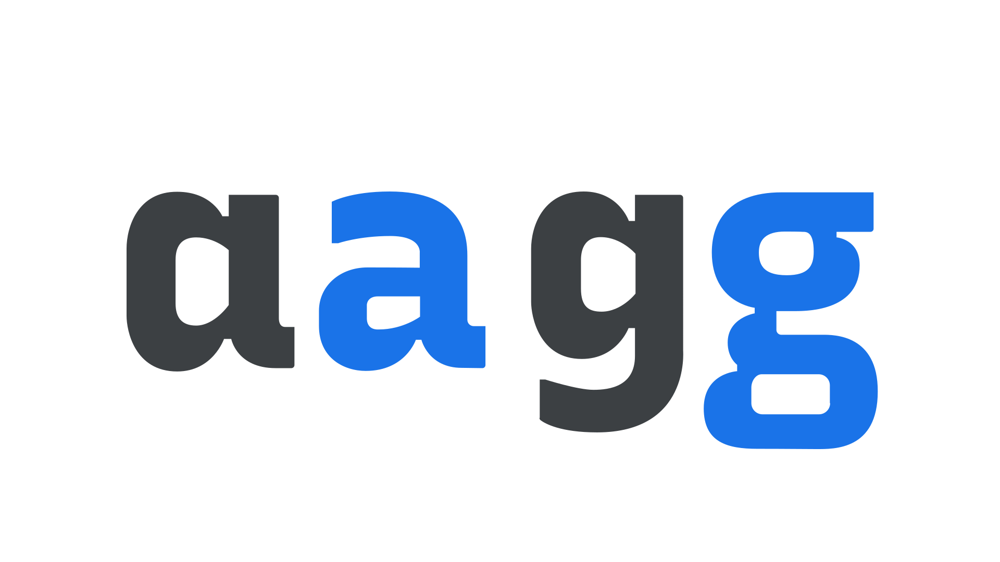
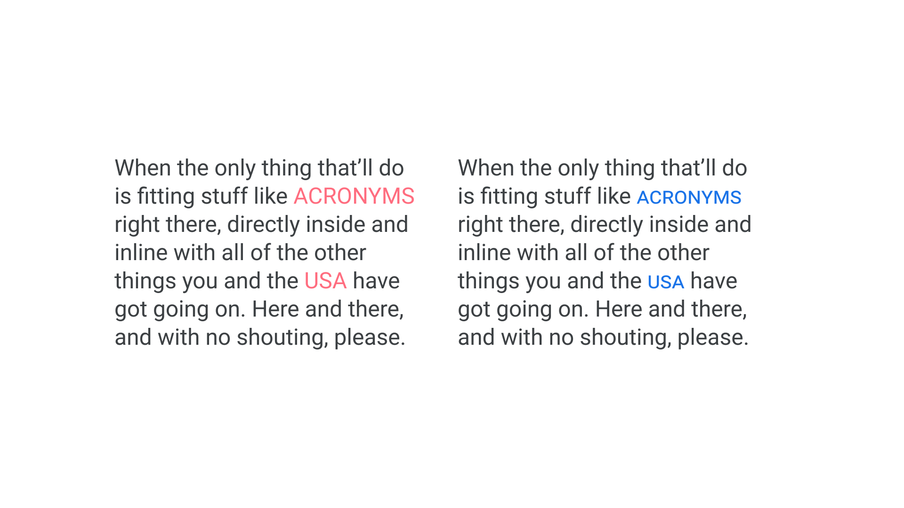

The default [characters](/glossary/character) we see in a [typeface](/glossary/typeface) aren’t necessarily the only options available to us. [Alternate](/glossary/alternates) [glyphs](/glossary/glyph) are often created by [type designers](/glossary/type_designer) to provide a broader palette of typographic possibilities beyond what’s available in the “normal” styles. This article provides an overview of the most common and useful kinds of alternates.

While sometimes these are available as separate sibling families, such as [Montserrat](https://fonts.google.com/specimen/Montserrat?query=montser) and [Montserrat Alternates](https://fonts.google.com/specimen/Montserrat+Alternates), they’re typically made available to us as [OpenType](/glossary/open_type) features within a single font file. OpenType is a [font](/glossary/font) technology (and [font format](/glossary/font_format)) that allows the end user—i.e., the designer—to access additional features in a font. The majority of those features, when turned on, enable the swapping of different versions of characters.

There’s so much potential typographic power to unlock via OpenType if the features exist within the font: From [swash characters](/glossary/swash_glyph) that add flourish to your display type, to [fractions](/glossary/fractions) that enable the legible setting of recipe ingredients; from proper [small caps](/glossary/small_caps) that prevent your uppercase abbreviations from appearing to shout at the reader, to intentional control over the different flavours of [numerals](/lesson/understanding_numerals); an understanding of OpenType is arguably one of the greatest tools a designer can have.

(And then there are OpenType Font Variations—better known as [variable fonts](/glossary/variable_fonts)—but that’s for [another article](/lesson/introducing_variable_fonts).)

## Ligatures

A [ligature](/glossary/ligature) joins commonly combined [characters](/glossary/character) into a single [glyph](/glossary/glyph) that typically makes for a more harmonious [reading](/glossary/legibility_readability) experience. A common example is the “fi” ligature, which combines a lowercase “f” and a lowercase “i” into a single character so that the shoulder of the f doesn’t clash with the dot of the i.

<figure>

</figure>

The “fi” example is known as a common ligature. “Discretionary ligatures” or “rare ligatures” are a separate group for lesser-used historical ligatures (or ligatures created for stylistics purposes), such as the combined “st” glyph, connected with a hoop.

<figure>

</figure>

## Swashes

A [swash](/glossary/swash_glyph) is a decorative variant of a particular character, most commonly found in [script](/glossary/script_typeface_style) [typefaces](/glossary/typeface), and has more elaborate and ornate flourishes than its regular version.

<figure>

</figure>

The most common placement for swashes is on the upper left of [uppercase](/glossary/uppercase_lowercase) letters, and on [ascenders and descenders](/glossary/ascenders_descenders) of lowercase letters. When working with swashes, it’s important to understand that they should enhance your design without degrading legibility. Taking a “less is more” approach can be helpful. Curiously, way too many sign-makers ignore this rule...

<figure>

<figcaption>The first line is incorrect, as the swashes on the “E” in the middle of each word clash with the letters in front of them; the second line, using swashes only for the first characters of each word, looks much better.</figcaption>

</figure>

## Numerals

[Numerals, or figures](/glossary/numerals_figures), are the [glyphs](/glossary/glyph) in a [typeface](/glossary/typeface) that represent numbers. In OpenType, it’s possible to select different types of numerals intended for different uses.

<figure>

</figure>

Learn more on our dedicated article, [“Understanding Numerals.”](/lesson/understanding_numerals)

## Fractions

[Fractions](/glossary/fractions) are much more legible when rendered correctly as symbols—e.g. “¾”—rather than written out in regular numerals—e.g. “3/4”—so it’s desirable to enable this correct rendering via OpenType whenever possible.

<figure>

</figure>

[//]: # (We’ve already prepared a dedicated article on fractions LINK TO RECIPE LESSON, so head over there to learn more.)

## Stylistic sets

[Stylistic sets, or style sets](/glossary/stylistic_sets), are groupings of alternate glyphs that allow the user to substitute multiple related glyphs at a time (although it’s possible for a style set to include only one glyph substitution). Note that even if a set appears to contain just one alternate—for instance, a single-storey “a”—it’ll update every instance of that character so that they all use the alternate form. Each font file can contain up to 20 stylistic sets.

<figure>

</figure>

## Contextual alternates

Contextual alternates are similar to ligatures in that glyphs are intelligently swapped based on their adjacent glyphs, but different in that they’re never combined into single forms. This can be used to make perfect joins between characters in a script, or to swap characters that might unintentionally clash.

If contextual alternates sound a little like stylistic sets, note that they differ for two reasons: First, stylistic sets have no “smart” awareness of context. Second, the glyphs and commands that power contextual alternates are all contained in one “on” or “off” control rather than a choice of sets.

<figure>

<figcaption>In the first example, note how the opening stroke of the “b” takes up a lot of space and appears to push the character too far away from the “o”. The second example has contextual alternates turned on: with the software knowing that the “b” follows an “o”, an alternate “b” glyph is automatically used instead, resulting in more harmonious spacing.</figcaption>

</figure>

## Small caps

[Small caps](/glossary/small_caps) are uppercase letterforms, but designed to sit alongside regular lowercase type. Why? [All-caps](/glossary/all_caps) text can be hard to read and appears to “shout” at the reader; small caps, by contrast, feel a more natural part of the text.

It’s advisable to employ small caps after three or more characters of uppercase text. For instance, there’s usually no need to set something like “US” in small caps, but a longer acronym, such as “UNESCO” will probably look better if more inline with the paragraph type. It’s usually advisable to add extra [tracking](/glossary/tracking_letter_spacing) to all caps text, too.

<figure>

</figure>

If switching an already captitalized word over to small caps (for instance, “University”), it’s possible to decide between setting all characters in small caps (known as “all small caps”) or just the lowercase letters (known as “small caps”), which would leave the “U” in the its standard uppercase form.

This is all just a taster of what OpenType can do. For more information, see:

- [clagnut.com/sandbox/css3](http://clagnut.com/sandbox/css3/)
- [docs.microsoft.com/en-us/typography/opentype/spec/featuretags](https://docs.microsoft.com/en-us/typography/opentype/spec/featuretags)
- [simoncozens.github.io/feature-tags](https://simoncozens.github.io/feature-tags/)
