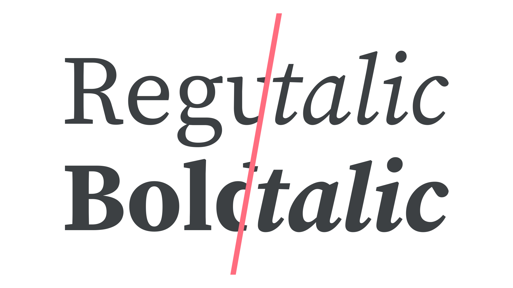
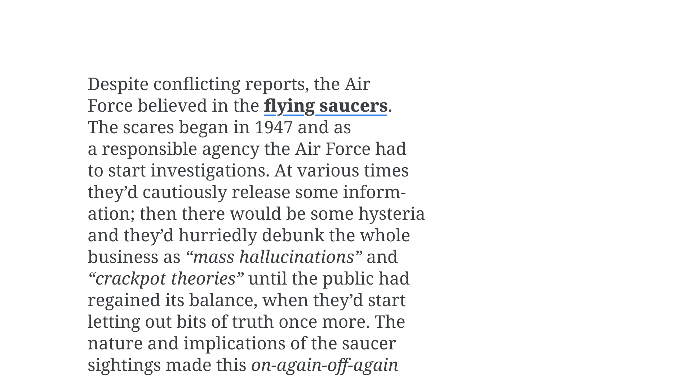
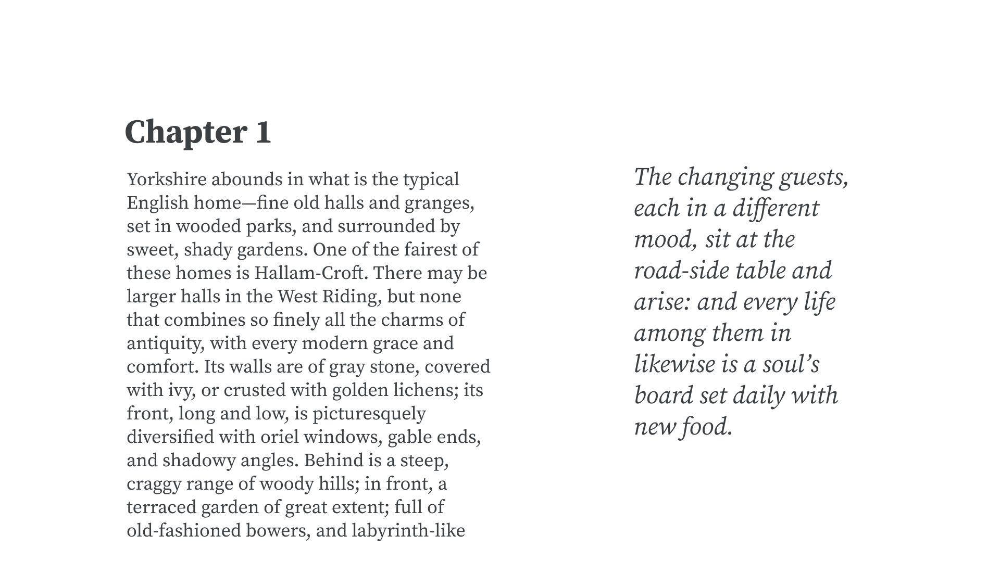
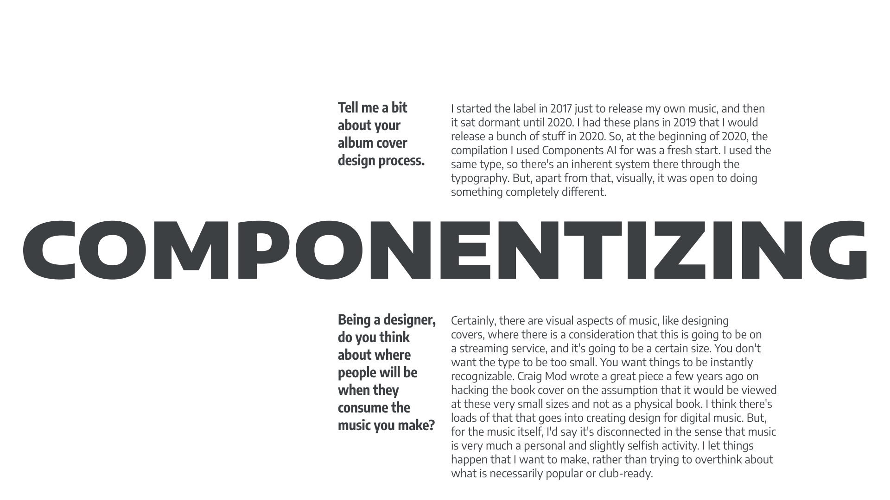
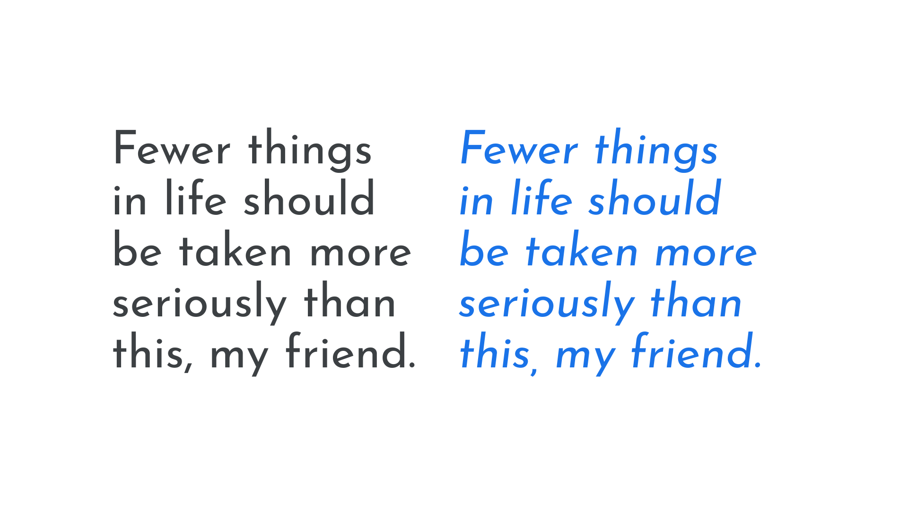
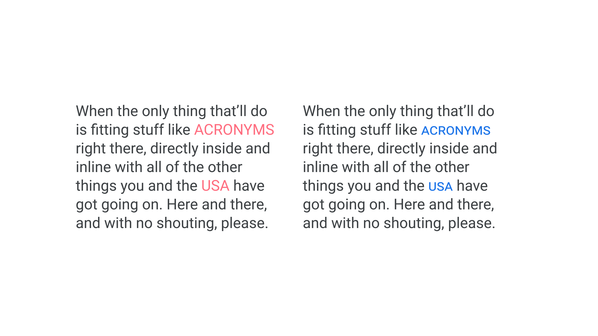
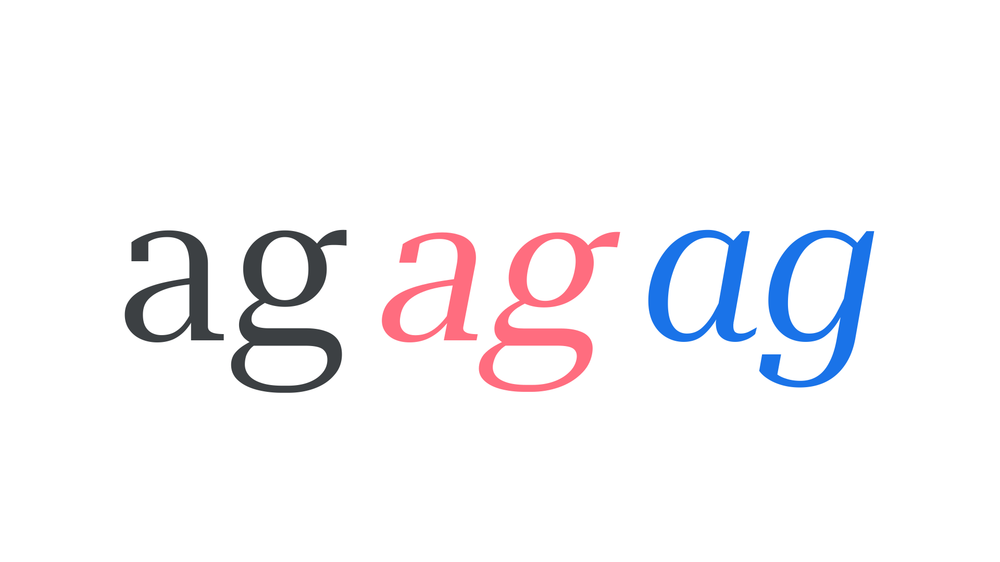
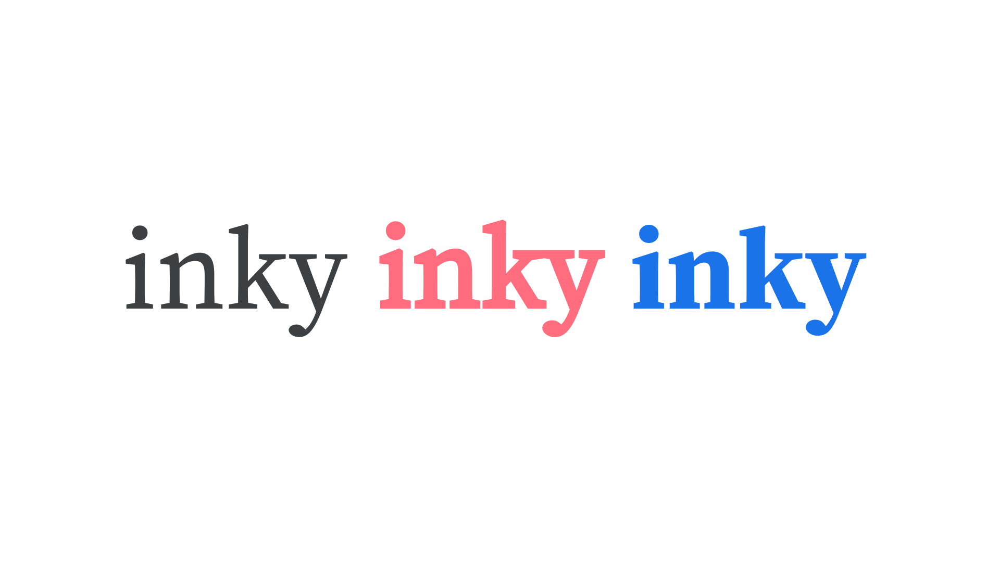

If we consider a [typeface](/glossary/typeface) to be the “core” design, then different [weights](/glossary/weight) and [styles](/glossary/style) could be said to be *extensions* of that design, and together they form a [type family](/glossary/family_or_type_family_or_font_family), or simply “family.” The most basic family usually contains four variations: two [upright](/glossary/regular_upright) weights—regular and bold—and two matching [italic](/glossary/italic) styles for each—regular italic* and bold italic.

<figure>

</figure>

Why do we need bolds and italics? Both offer ways of differentiating certain parts of the [text](/glossary/text_copy), and—assuming that the majority of our copy is set in a regular weight—the occasional word or phrase in a bold weight or italic style suggests emphasis, and therefore aids the reader in understanding the meaning of the text.

However, because both bold *and* italic can be used to suggest emphasis, it’s sensible to employ only one of them for that use. Traditionally (and depending on the style guide), text styled with italics tends to suggest words or phrases the reader should pay special attention to, or perhaps make it obvious which parts of the text are quotations, or denote titles of books, films, or pieces of music. In this circumstance, it’s often sensible to reserve bold type for something else entirely, such as a hyperlink:

<figure>

</figure>

Bold and italic also offer enough stylistic variation from regular type to (potentially) imply hierarchy. An obvious example would be setting headings in a bold weight to differentiate them from paragraphs in regular weight. It could be useful to employ an italic style to signify a different (if not necessarily hierarchical) typographic element, such as an accompanying pull quote:

<figure>

</figure>

Of course, neither bolds nor italics are strictly required to set text. Lowercase bold type didn’t exist until the 19th century; the bold italic style only arrived with the age of the personal computer (to account for the “B” and “I” buttons in popular word processing software). And, giving a word or phrase two levels of emphasis—bold *and* italic—is rarely needed.

However, choosing a typeface with a bold weight and italic style sets us up well for most scenarios and, when working in environments where others are in control of the text—such as websites controlled by content management systems (so pretty much all of them)—it ensures all of our bases are covered.

## Beyond bold and italic

Bold is just one weight, though. For some content, such as different levels of headings, it might not be enough to only have one extra weight at our disposal. What about setting a heading in an extra bold instead? Or, if the bold isn’t significantly heavier than the regular weight, text that might usually become bold could be set in a black weight instead. Or, what if the regular weight is just a little too heavy? The body text might look better in the light weight.

Bold and italic are just the beginning—true typographic flexibility comes in the form of multiple weights and matching italics for each. We examine this in our article, [“Exploring Typefaces with Multiple Weights or Grades.”](/lesson/exploring_typefaces_with_multiple_weights_or_grades)

For occasions when the traditional weight delineations don’t quite cut it, we also now have the power of [variable fonts](/glossary/variable_fonts) at our disposal: We get to decide *exactly* how light or heavy our type needs to be.

And why stop at weight? With many families offering narrower or wider versions of a typeface, choosing a different [width](/glossary/width) opens up even more possibilities to us, from using narrow type to fit long headlines into small spaces, to using ultra expanded type to convey a different personality for [display](/glossary/display) text. And again, we can now enjoy precise control over exactly *how* wide our type is thanks to variable fonts. We examine the advantages of multiple widths in our article, [“Exploring Width in Type.”](/lesson/exploring_width_in_type)

<figure>

</figure>

## Obliques, small caps, and other styles

For this introductory piece, we’ve mainly stuck to italics when talking about style, but actually there are more versions of type designs that come under the umbrella of “style.”

Many italics—especially those found in [grotesques](/glossary/grotesque_neo_grotesque)—actually use [oblique](/glossary/oblique) [letterforms](/glossary/letterform). Italics have a structure informed by cursive writing, whereas oblique [characters](/glossary/character) follow the structure of the [upright](/glossary/regular_upright) styles. Unlike the faux italics we address below, though, obliques are not merely [digitally slanted](/glossary/faux_fake_pseudo_synthesized); optical corrections are made to avoid distortions and an incorrect distribution of weight.

Note, however, that italics and obliques are not mutually exclusive: Although less common, it’s possible for a typeface to have both italic *and* oblique forms, such as such as those in Erik Spiekermann’s FF Real.

And then we have [small caps](/glossary/small_caps): small, uppercase letterforms designed to sit alongside lowercase type. Just like italics and obliques, small caps offer an alternate form of the alphabet within the same type family.

For even more more control, where we can make decisions that affect only certain characters, we have even more alternate forms available to us to use via [OpenType](/glossary/open_type). We outline these in our article, [“Introducing Alternate Glyphs.”](/lesson/introducing_alternate_glyphs)

Hopefully it’s become apparent how the humble bold and italic are gateways to a far richer world of typography, full of multiple weights, styles, widths, alternates, and variations!

## Avoiding fake weights and styles

Before moving on from this introduction weights and styles, it’s important to look at what can happen when those basics *aren’t* in our typographic toolkit. [Faux bolds and faux italics](/glossary/faux_fake_pseudo_synthesized)—those that are rendered artificially by software—are everywhere, especially on the web, and it’s every typographer’s responsibility to avoid them at all costs.

When software attempts to emulate a bold (or other) weight or an italic style, in lieu of actual [font files](/glossary/font) for those variants, they’re referred to as “faux” or “fake” or “pseudo” or “synthesized.” Typically this occurs on desktop graphic design software when the user is attempting to use a certain weight (e.g. bold) but doesn’t have that font installed/activated; or, on the web, when a site is attempting to render a bold weight (etc.) but isn’t serving that font file to end users.

Faux italics are easy to spot with very little training because true italics are noticeably different. Rather than being slanted versions of their roman forms, true italics are completely original drawings, with several characters that can look notably different. For instance, a double-storey lowercase “a” often becomes single-storey in its italic form; the same is true of a lowercase “g.” In faux italics, letterforms’ weights shift, distorting the thick and thin parts of the stroke in the wrong angle.

<figure>

<figcaption>An upright form, an incorrectly synthesized rendering, and a true italic.</figcaption>

</figure>

(Faux obliques, even though much closer in the design of their letterforms, still appear unbalanced when compared to their true counterparts.)

Faux bolds are a little harder to spot because heavier weights don’t change their core traits too much. In true bolds, designers make small adjustments to balance the whitespace in and around  the letter to make it more legible. However, faux bolds add weight uniformly, which can sometimes close up counter forms and lead to "inky" visual disruptions in the type—a bit like having a stroke placed around the letterforms, they often look bloated and too tightly spaced. If you switch to a bold and the text looks bloated and the spacing looks too tight, chances are it’s a faux bold.

<figure>

<figcaption>Regular type, an incorrectly synthesized rendering, and a true Bold.</figcaption>

</figure>

Because of the ease of software implementing faux italics or faux bolds, designers should avoid the scenario if at all possible using the tools at our disposal. The absolute best way to do that is to pick a typeface that contains at least the basic four variations.

[//]: # (If you can’t do that, we have a short article dedicated to preventing faux approximations in CSS - /lesson/avoiding_browser_distortions)

_*It’s a personal frustration of your author that the “Regular Italic” font is usually just referred to as “Italic." In my opinion, this makes looking at a list of all available variations confusing, since all other italics are inevitably preceded by the name of the weight they relate to._
