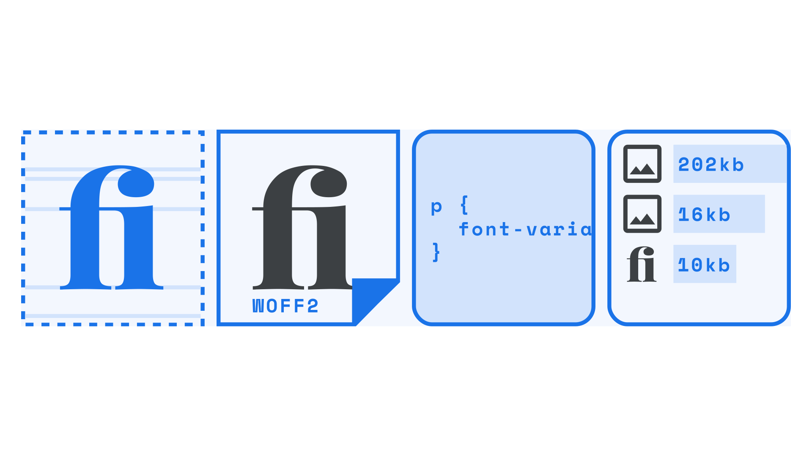

When attempting to implement any [OpenType](/glossary/open_type) feature—whether you’re working on a website, an app, or in print—it’s important to ensure that it’s actually doable. Consider the typeface, the font file, the browser (and/or device), and consider the reader.

<figure>

</figure>

Let’s dive into each in detail:

## Consider the typeface

The first question to ask is: does the [typeface](/glossary/typeface) itself support the OpenType feature we want to use? In other words: has the [type designer](/glossary/type_designer) included those [glyphs](/glossary/glyph) we need, such as that particular [ligature](/glossary/ligature) or that particular [ordinal](/glossary/ordinals)? We mustn’t assume that just because the typeface has *some* OpenType features, such as common ligatures, that it will include others.

## Consider the font file

Secondly, does the [font](/glossary/font) file include those OpenType features? Even if we know that they exist—perhaps because we’ve seen specimens of some fancy [swashes](/glossary/swash_glyph) on the [type foundry’](/glossary/type_foundry)s website—the particular font file we’re using might not necessarily include the glyphs we need.

There are a number of reasons this could be the case, such as a “lite” or non-“pro” version of the font that’s available at a lower price, or perhaps a version that’s coming from a content delivery network over which we have no control. Web fonts sold directly from a foundry website aren’t necessarily the same versions that appear on font delivery services such as Google Fonts or Adobe Fonts, so it always pays to check.

At the time of writing, non-essential OpenType features *aren’t* included in web fonts served via Google Fonts’ API; however, the OpenType features are still present in the downloadable fonts, which can then be [self-hosted](/lesson/self_hosting_web_fonts).

## Consider the browser and/or device

This step is relevant if we’re building a website and will depend on [browser support](https://caniuse.com/?search=opentype) for OpenType—and potentially device support, too. If we’re building an app, this will most definitely depend on device support.

If we’re absolutely sure the typeface contains designs for the OpenType features we need, but they’re not rendering, then the next thing to check is the browser and/or device. Support for OpenType is now widespread in modern browsers, in both desktop and mobile versions; however, it’s still possible that some features may not be fully supported—or partially supported—on different versions of that browser.

If we’re sure that the OpenType support is present on the device we’re testing on, the only reason it wouldn’t be working at this point is if our code has an error in it.

## Consider the reader

There’s one final consideration we should bear in mind before attempting to implement any OpenType feature, and although it’s last on the list, it’s actually the most important: How will the reading experience, altered by the presence of any given OpenType feature, affect the reader? Hopefully it’ll only be in a good way—perhaps we’re using some ligatures or fractions to aid legibility, or throwing in some swashes to liven up a heading on a landing page—but we must remember that these extras can come at a cost: Font files with additional OpenType-centric glyphs will have a [larger file size](/glossary/file_size), and therefore take a few milliseconds longer to download to the user’s device. (Even if we’re bundling the fonts inside an app, rather than pulling them in dynamically, they’ll still contribute to the overall file size.) For those users on a slow connection, that might be a sacrifice that no amount of typographic flourish can justify.

When working in print, bandwidth is less of a concern, but still the overall reading experience of the user should *always* be our primary justification for using (or not using) any OpenType feature.
