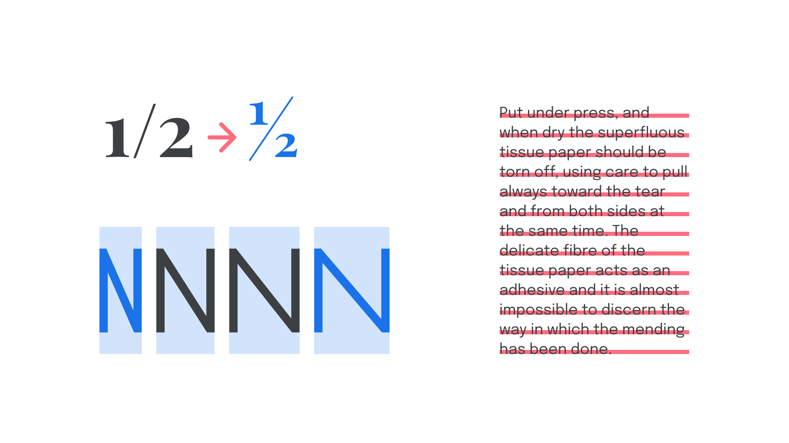
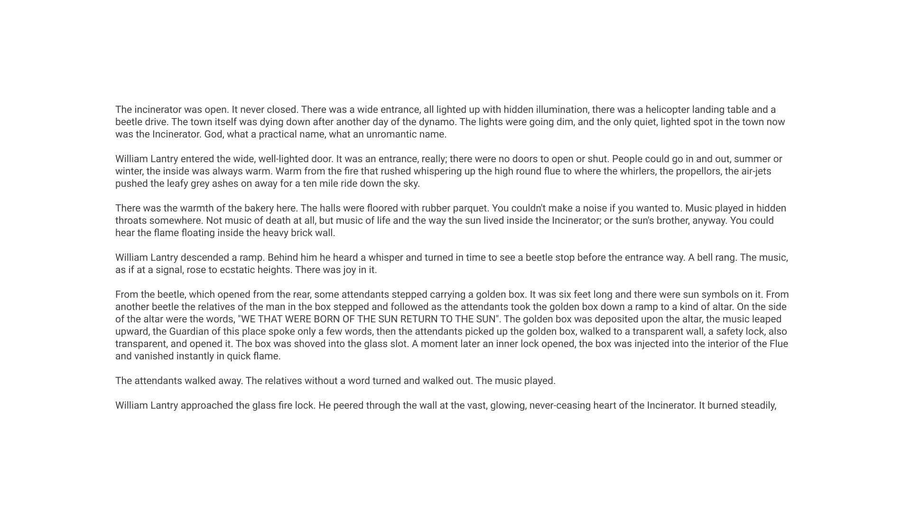
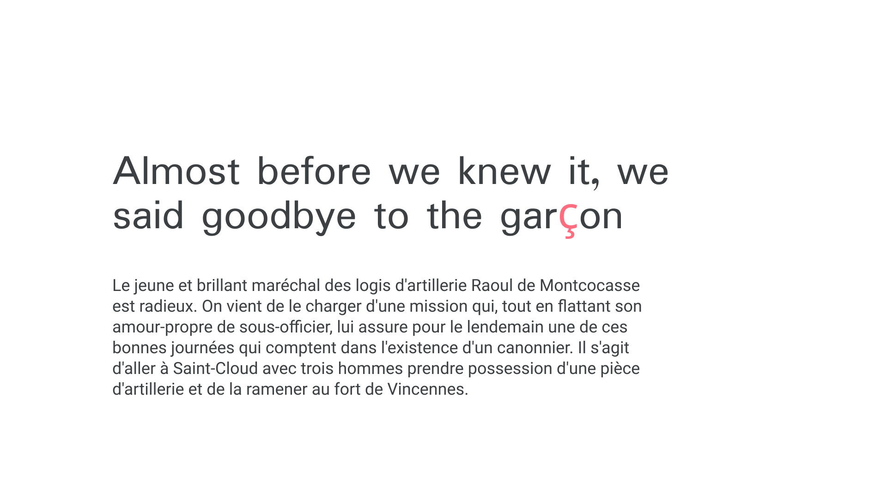
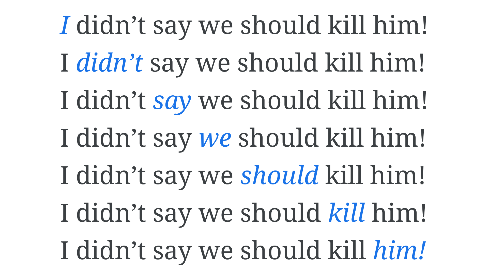

When you think of the word “[typography](/glossary/typography)”, what comes to mind?

Most likely, it’s [fonts](/glossary/font) or [typefaces](/glossary/typeface). And that’s a good start! We can’t help but look at [type](/glossary/type) any time we read [text](/glossary/text_copy) (unless we’re reading [handwriting](/glossary/handwriting), [calligraphy](/glossary/calligraphy), or [lettering](/glossary/lettering)), but the act of choosing typefaces isn’t *actually* part of the practice of typography. Typography is the decisions we make with how type is applied to text—no matter what the typeface is—to offer a comfortable reading experience and a stylistic expression. In many projects, the typeface has already been chosen (such as when working with existing brands), so being able to get the most of *any* typeface is a useful skill to have.

One of the most important truths about typography is that it’s possible to do great design work with a poor quality typeface, just as it’s possible to create something awful with a good typeface—a bit like how it’s possible to ruin a meal if we have great ingredients but don’t know how best to cook them.

In many scenarios, the default settings in our design apps—or even word processing apps—can get us quite far, but an understanding of how to use different weights, styles, spacing, and font technology allows us to do a much better job as designers. Well considered typographic choices enhance the meaning of text in branding work, aid the user’s intent in wayfinding, and allow our readers to read *better.*

<figure>

</figure>

Like all aspects of design, typography has the power to work on an [emotional](/lesson/emotive_considerations_for_choosing_typefaces) and subliminal level—guiding the end user down a certain path and providing context for the content they’re absorbing and the message the brand is trying to send. Is it playful? Edgy? Authoritative? Convention-challenging?

Type is meant to be *read,* so the reader’s concentration is focussed on reading the words themselves. Therefore, typography often works in the background more so than any other aspect of visual design. Deliberate typeface choices and thoughtful typographic decisions serve to honor the content, whether it’s an entire book, a portfolio website, an e-commerce app, a resume, an annual report, or even just a one-word logo.

On the flip side, lazy or clumsy typography can ruin the reading experience for the reader and can very easily cause them to disconnect from the content. Imagine seeing a crooked painting in an art gallery—we might doubt how seriously the gallery takes the art if they haven’t made the effort to present it in the best possible way.

How often have you been distracted by overly wide columns in a magazine article that make it hard for your eye to find the next line?

<figure>

</figure>

Or a blog post that suddenly looks inexplicably different when there’s the occasional character from another language?

<figure>

</figure>

Or a vertical spacing gap that leaves a heading detached from its content?

<figure>

</figure>

If time isn’t taken to consider the way our message is presented to our readers, we run the risk of sending the *wrong* message, or suggesting to our readers that we don’t really care about the message at all.

In fact, poor typographic practice—or poor knowledge of typographic control—can have some pretty serious consequences. Consider the [“Flash of Invisible Text”](/glossary/foit) that can [make headlines on newspaper websites completely false](https://www.zachleat.com/web/mitt-romney-webfont-problem/), or what happens when the use—or lack—of an italic style can radically change the meaning of a sentence:

<figure>

<figcaption>Changing which word is emphasized in the sentence changes its meaning entirely.</figcaption>

</figure>

The purpose of **Google Fonts Knowledge** is to equip you with the knowledge you’ll need to choose and use type with purpose. Start exploring with the “Further reading” links below.
