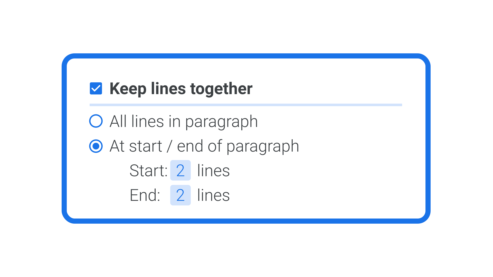

[Widows and orphans](/glossary/widows_orphans) are lines that appear by themselves at either the top (widow) or bottom (orphan) of a column of [text](/glossary/text_copy). Additionally, an orphan can refer to the first line of a new paragraph that sits on its own at the bottom of a column of text.

Because they occur frequently when setting long-form text, it’s useful to know how to tackle them when they arise in order to make our text as readable as possible.

<figure>

<figcaption>The first example shows a leftover word from the previous paragraph (widow); the second shows a lone word on the end of the current paragraph (orphan). On the right, both examples are corrected.</figcaption>

</figure>

Like so many things in [typography](/glossary/typography), avoiding widows and orphans means [breaking the rules](/lessons/breaking_the_rules) a little. For instance, while it might be technically correct to have just one word at the end of a line, it creates an undesirable amount of whitespace to the right of that word (in left-aligned text). It's more pleasing to the eye if we push one more word from the penultimate line down to the last.

Beware, though: Creating a line break like this inserts a break character permanently, meaning it will come along for the ride if a user copies and pastes our text. So we need to choose between a hard line break or a non-breaking space. We’ll use a hard line break if we intend the line to break at that very point in all circumstances, or a non-breaking space if we intend the last two words in a paragraph to stay together.

In desktop design software—and even the humble word processor—it’s best to look into the settings for widow and orphan control, which will automatically fix the problem for us. But we’ll need to be okay with empty lines appearing at the bottom of our columns, which will occur as a consequence. This is almost always okay in single-column pages, but can be distracting in two columns or more.

<figure>

<figcaption>An approximation of the user interface of desktop design software, showing widow and orphan controls.</figcaption>

</figure>

Sadly, while fixing widows and orphans in print design and word processing software is relatively easy, it’s considerably more difficult to do on the web (and in apps). Primarily, this is because the screen is—and should always be—a responsive medium, where content can ebb and flow according to the constraints of the device and the needs of the user. That means hard line breaks are most definitely out! As a consequence of working in this medium, widows and orphans are likely to occur in our screen-based designs. How much time and energy we spend fixing them is up to the individual designer.

If we *do* choose to tackle widows and orphans on the web and in apps, non-breaking spaces (in HTML, `&nbsp;`) are the easiest defence. At the time of writing, the automatic tools baked into CSS have only [limited support](https://caniuse.com/?search=page-break), but there are JavaScript plugins that can handle the automatic insertion of non-breaking spaces for us.
