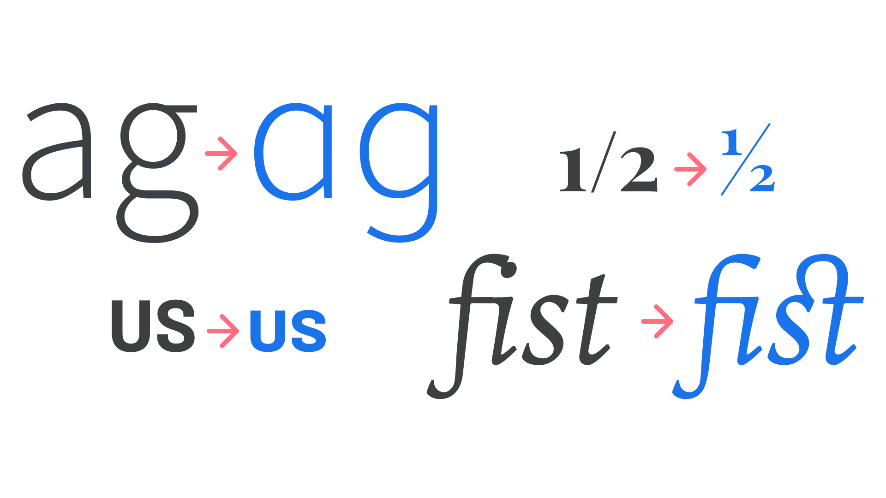

Once we’re ready to add [OpenType](/glossary/open_type) features to our web [typography](/glossary/typography), implementing them via CSS is a relatively straightforward affair. There are two things we’ll need to have at hand: The first is confirmation that the [font](/glossary/font) file definitely [contains the OpenType feature](/lesson/open_type_features_in_practice) we intend to use; the second is the unique, four-character code used to reference that feature (see the end of this article). We’ll also need to be familiar with [loading web fonts](/lesson/using_web_fonts) in the first place.

## The basics

Let’s say we want to use the standard ligatures that are present in many fonts. For our example, we’ll set some paragraph text with [Newsreader](https://fonts.google.com/specimen/Newsreader) (a typeface that contains such ligatures) and serve the font via Google Fonts—a version that definitely includes those glyphs in the font files. (It’s possible to check what features our fonts contain using a service such as [wakamaifondue.com](https://wakamaifondue.com/).) The four-character code for standard ligatures is “liga” so let’s turn that on:

```css
p {
	font-feature-settings: "liga"; /* Turn ligatures on */
}
```

<figure>


</figure>

We’re going to dive deeper as this article progresses, but for now, this is the basic way of enabling OpenType: Simply use the `font-feature-settings` property to reference the four-character code you need.

Now, ligatures are an interesting one. Because they’re actually turned on by default for most browsers, at most viewport sizes, we rarely need to turn them on manually. But what if we don’t *want* them to be turned on? For instance, what if we [apply a very open tracking setting to our text](/lesson/track_carefully_or_not_at_all)? Turning them off is as simple as adding either “off,” or “0”:

```css
p {
	font-feature-settings: "liga" off; /* Turn ligatures off */
}
```

(And yes, adding “on” rather than “off”—or a 1 instead of a 0—will indeed turn them on again. But the  “on” or “1” isn’t necessary, so it’s up to us whether or not to use it. It’s best to pick a convention of our choosing and just remember to be consistent with it.)

There are other OpenType features that make use of numerals, which is why our recommendation is to use “on” or “off” instead of 1 or 0. For instance, `“swsh” 3` will give us the third kind of [swash](/glossary/swash_glyph) (assuming the font has that many):

```css
p {
	font-feature-settings: "swsh" 3; /* Use the third kind of swash alternates */
}
```

Another feature turned on by default in most circumstances is [kerning](/glossary/kerning_kerning_pairs), so again we don’t need to concern ourselves with it too much unless we specifically choose to turn it off. We recommend keeping it on, as kerning will almost always aid legibility. Perhaps the only reason to ever turn it off would be if we disagree with the [type designer](/glossary/type_designer)’s kerning-pair decisions.

## High-level settings

While implementing OpenType features using the `font-feature-settings` property is straightforward, it’s a so-called low-level setting. As explained by [Mozilla](https://developer.mozilla.org/en-US/docs/Web/CSS/CSS_Fonts/OpenType_fonts_guide):

> The issue with using font-feature-settings for everything is that every time you want to change one of the individual features, you have to redefine the entire string (similar to manipulating variable fonts with font-variation-settings).
>

It’s not necessarily a bad thing: We may prefer the simplicity of one relatively simple syntax. Using the high-level settings requires us to memorize a slightly more complex naming convention, after all. Consider the following:

```css
font-feature-settings: "ss01"; /* Stylistic set 1 on, low-level */
font-variant-alternates: styleset(ss01); /* Stylistic set 1 on, high-level */

font-feature-settings: "frac"; /* Diagonal fractions on, low-level */
font-variant-numeric: "diagonal-fractions"; /* Diagonal fractions on, high-level */

font-feature-settings: "smcp"; /* Small caps on, low-level */
font-variant-caps: "small-caps"; /* Small caps on, high-level */

font-feature-settings: "diga"; /* Discretionary ligatures on, low-level */
font-variant-ligatures: "discretionary-ligatures"; /* Discretionary ligatures on, high-level */
```

<figure>



</figure>

But, if we’re prepared to live with the slightly different names, there’s certainly an extra level of control the high-level settings afford us. And, it negates the need to find ways of dealing with [the override issues that low-level settings present](https://pixelambacht.nl/2019/fixing-variable-font-inheritance/). Be aware that many of the high-level settings don’t currently enjoy widespread browser support, however.

Our recommendation is to use the high-level syntax in order to write future-facing CSS, but it’s also possible to use the new `@supports` query so that the more cutting-edge properties are only served to browsers that support them, like so:

```css
.fraction {
    font-feature-settings: frac; /* Low-level setting for all browsers */
}

@supports (font-variant-numeric: diagonal-fractions) {
  .fraction {
      font-feature-settings: normal; /* Reset the low level, then... */
      font-variant-numeric: diagonal-fractions; /* ... use the better code */
  }
}
```

Note that this will of course add more kilobytes to the CSS file. Full details on the correct syntax for the high-level settings can be found on [Mozilla’s OpenType font features guide](https://developer.mozilla.org/en-US/docs/Web/CSS/CSS_Fonts/OpenType_fonts_guide).

[//]: # (We could potentially aim to re-create or distill this into a future update of this article, or its own lesson.)

## Common OpenType feature reference

In order to use OpenType features on the web, it’s necessary to turn them on via CSS, and the easiest way to do that is to reference their unique four-character codes. Here’s a list of the most common ones that we can refer back to as needed:

```
Oldstyle Figures (onum)
Lining Figures (lnum)
Tabular Figures (tnum)
Slashed Zero (zero)
Fractions (frac)
Superscript (sups)
Subscript (subs)
Ordinal (ordn)
Small Caps (smcp)
Small Caps from Capitals (c2sc)
Case-Sensitive Forms (case)
Standard Ligatures (liga)
Discretionary Ligatures (dlig)
Historical Ligatures (hlig)
Contextual Alternates (calt)
Swash (swsh)
Historical Forms (hist)
Stylistic Sets (ss01 to ss20)
Kerning (kern)
Localised Forms (locl)
```
