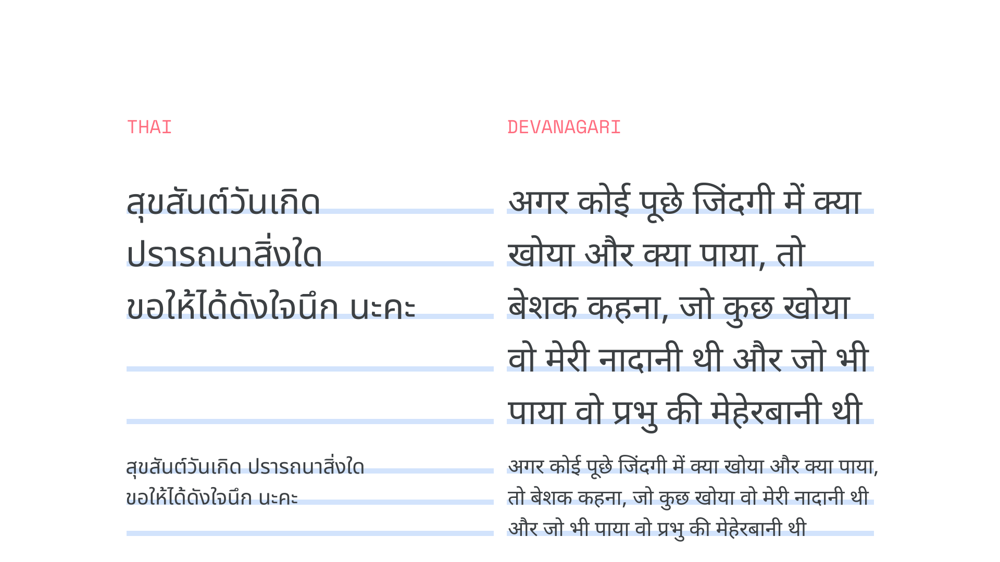

Each written language uses its own set of [characters](/glossary/character). And if our UI uses multiple languages, then our [typography](/glossary/typography) should vary depending on the language.

[Scripts, or writing systems](/glossary/script_writing_system), are groups that contain characters used by one or more languages. For instance, although English, French, German, Norwegian, and Portuguese are distinct languages—with their own alphabets, conventions, and [diacritic](/glossary/diacritic_accent_marks) usage—they all use the [Latin script](/glossary/latin). Other writing systems include Greek (upon which Latin is based), Cyrillic, Arabic, Korean, Thai, the various scripts of Africa, the closely related Devanagari and Bengali, and the Han characters in use in various Asian languages, including Chinese and also Japanese.

<figure>

</figure>

Word length can vary greatly across languages, even those that use the same [glyphs](/glossary/glyph), such as English and German.

<figure>

</figure>

English is often shorter than other European languages. For instance, German has many compound words that are longer, requiring more lines or different line spacing settings.

## Alignment & direction
Some writing systems, such as Arabic and Hebrew, are displayed with characters appearing from right to left.

<figure>

</figure>

UIs for languages that are read from right-to-left (RTL), such as Arabic and Hebrew, should be mirrored to ensure content is easy to understand. For more information, please read [Bidirectionality on Material Design](https://material.io/design/usability/bidirectionality.html#mirroring-elements).

Many writing systems might require different [line-height](/glossary/line_height_leading) and spacing adjustments. Line length, line spacing, and character spacing can vary within a script that is used for many languages.

## Height

Many writing systems require more vertical space than English, so our UI should provide sufficient vertical space to account for this. For instance, while Vietnamese is written with Latin, it has accents that add height to some letters, such as Ớ.

<figure>

</figure>

## Vertical typesetting

Vertical typesetting, though less commonly used, can display characters vertically instead of horizontally.

The typography of China, Japan, and Korea is typically monospaced, which means each letter occupies the same amount of space. It is often set left-to-right, top-to-bottom. It can also be set vertically: top-to-bottom and right-to-left.

More than one typeface may need to be used in the same UI to display multilingual content when each language uses a different writing system.

<figure>

<figcaption>Above: Type set left-to-right and top-to-bottom. Below: Type set vertically, top-to-bottom and right-to-left.</figcaption>

</figure>

For ease of internationalization, Google has categorized languages into three categories: Latin or Latin-like, tall, and dense.

**Latin or Latin-like typefaces:** The languages of Western, Central, and Eastern Europe and many parts of Africa are typically written in the Latin script. Vietnamese is a notable exception in that, while it uses a localized form of the Latin writing system, its accented glyphs can be much taller than those found in Western European languages. The Greek and Cyrillic writing systems are very similar to Latin in their vertical proportions.

**Tall typefaces:** These are the scripts that require extra line height to accommodate larger glyphs, including South and Southeast Asian and Middle-Eastern languages, like Arabic, Hindi, Telugu, Thai, and Vietnamese.

**Dense typefaces:** These scripts, like the “Tall typefaces,” also require extra line height to accommodate larger glyphs, but additionally take into account the higher density of characters in languages such as Chinese, Japanese, and Korean.

## Noto

In Android, Noto fonts are the default typefaces for all languages not covered by the original Roboto. The set is designed to be visually harmonious across languages and scripts, with compatible heights and stroke thicknesses. The project covers over 150 scripts, each defined in Unicode.

For more about Noto, please visit [the Noto page on Google Fonts](INSERT_URL).

Noto Chinese, Japanese, and Korean (CJK) typefaces each have seven weights that match the original Roboto, with the same weight settings as English.

<figure>

</figure>

In CJK scripts, line height is slightly larger than Latin-based characters.

<figure>

</figure>

## Tall script considerations

Noto supports tall scripts used in South and Southeast Asian and Middle Eastern languages, including Arabic, Hindi, and Thai. Try using the Regular weight, as the Medium weight is unavailable in Noto.

<figure>

</figure>

In Thai and Devanagari, the tall script line height is slightly larger than Latin-based characters.

<figure>

</figure>

## Language categories reference

|Code | Description | Category |
| --- | --- | --- |
| af | Afrikaans | Latin or Latin-like |
| am | Amharic | Latin or Latin-like |
| ar | Arabic (Modern Standard) | Tall |
| az | Azerbaijani | Latin or Latin-like |
| bg | Bulgarian | Latin or Latin-like |
| bn | Bengali | Tall |
| ca | Catalan | Latin or Latin-like |
| cs | Czech | Latin or Latin-like |
| cy | Welsh| Latin or Latin-like |
| da | Danish | Latin or Latin-like |
| de | German | Latin or Latin-like |
| el | Greek | Latin or Latin-like |
| en | English (US) | Latin or Latin-like |
| en-GB | English (UK) | Latin or Latin-like |
| es | Spanish (European) | Latin or Latin-like |
| es-419 | Spanish (Latin American) | Latin or Latin-like |
| et | Estonian | Latin or Latin-like |
| eu | Basque | Latin or Latin-like |
| fa | Persian | Tall |
| fi | Finnish | Latin or Latin-like |
| fil | Filipino | Latin or Latin-like |
| fr | French (European) | Latin or Latin-like |
| fr-CA | French (Canadian) | Latin or Latin-like |
| gl | Galician | Latin or Latin-like |
| gu | Gujarati | Tall |
| hi | Hindi | Tall |
| hr | Croatian | Latin or Latin-like |
| hu | Hungarian | Latin or Latin-like |
| hy | Armenian | Latin or Latin-like |
| id | Indonesian | Latin or Latin-like |
| is | Icelandic | Latin or Latin-like |
| it | Italian | Latin or Latin-like |
| iw | Hebrew | Latin or Latin-like |
| ja | Japanese | Dense
| ka | Georgian | Latin or Latin-like |
| kk | Kazakh | Latin or Latin-like |
| km | Khmer | Tall |
| kn | Kannada | Tall |
| ko | Korean | Dense
| ky | Kirghiz | Latin or Latin-like |
| lo | Lao | Latin or Latin-like |
| lt | Lithuanian | Latin or Latin-like |
| lv | Latvian | Latin or Latin-like |
| mk | Macedonian | Latin or Latin-like |
| ml | Malayalam | Tall |
| mn | Mongolian | Latin or Latin-like |
| mr | Marathi | Tall |
| ms | Malay | Latin or Latin-like |
| my | Burmese (Myanmar) | Tall |
| ne | Nepali | Tall |
| nl | Dutch | Latin or Latin-like |
| no | Norwegian (Bokmål) | Latin or Latin-like |
| pa | Punjabi | Tall |
| pl | Polish | Latin or Latin-like |
| pt | Portuguese (Brazilian) | Latin or Latin-like |
| pt-PT | Portuguese (European) | Latin or Latin-like |
| ro | Romanian | Latin or Latin-like |
| ru | Russian | Latin or Latin-like |
| si | Sinhala | Tall |
| sk | Slovak | Latin or Latin-like |
| sl | Slovenian | Latin or Latin-like |
| sq | Albanian | Latin or Latin-like |
| sr | Serbian (Cyrillic) | Latin or Latin-like |
| sr-Latn | Serbian (Latin) | Latin or Latin-like |
| sv | Swedish | Latin or Latin-like |
| sw | Swahili | Latin or Latin-like |
| ta | Tamil | Tall |
| te | Telugu | Tall |
| th | Thai | Tall |
| tr | Turkish | Latin or Latin-like |
| uk | Ukrainian | Latin or Latin-like |
| ur | Urdu | Tall |
| uz | Uzbek | Latin or Latin-like |
| vi | Vietnamese | Tall |
| zh-Hans | Chinese (Simplified) | Dense
| zh-Hant | Chinese (Traditional) | Dense |
| zu | Zulu | Latin or Latin-like |
