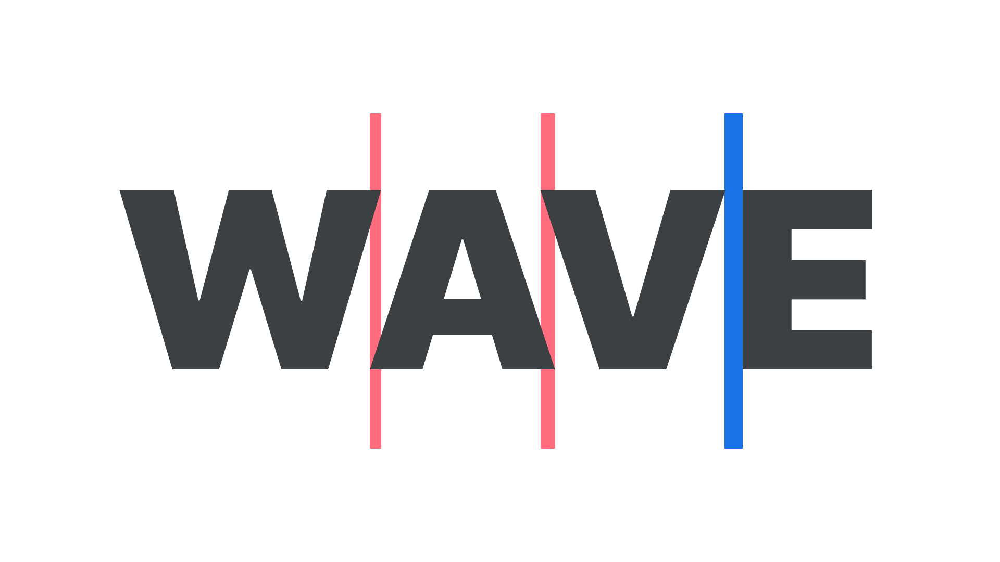

The need for us designers to [kern](/glossary/kerning_kerning_pairs) is actually quite rare, thanks to the diligent work of professional [type designers](/glossary/type_designer). When adjusting spacing values for our [type](/glossary/type), we usually want [tracking](/glossary/tracking_letter_spacing)—the overall control for letter spacing on an element—rather than kerning (the tweaking of the space between two specific [glyphs](/glossary/glyph)).

In any well-crafted [font](/glossary/font), the type designer will have created multiple kerning pairs—data within the font file that alters the spacing between characters that might otherwise appear too far away, such as “AV” or “To” (or too close, such as “www”).

<figure>


</figure>

Usually custom kerning is only required if a font isn’t well spaced or lacks kerning-pair data, or perhaps if we’re creating a logo and want to ensure a particular lockup.  In the latter scenario, even for a well-spaced font, when a few characters are set apart, unsupported by the rest of the typeface, there may be the rare occasion when these letters might benefit from some subtle and careful kerning to harmonize them.

Most desktop design software allows us to kern by placing the cursor between the glyphs whose spacing we want to alter; on the web, there’s a little more work involved:

In our HTML, let’s locate the characters we’d like to kern. We’ll wrap them in a `span` with a unique class, and then adjust the `letter-spacing` value for that class in our CSS. (Okay, we said *tracking* was expressed in CSS as letter-spacing; it’s true that it can be used to kern, too.)

```html
<p>
  <span class="tighter">T</span>race.
</p>
```

```css
p {
  letter-spacing: 0em;
}
p span.tighter {
  letter-spacing: -0.0125em;
}
```

To practice manual kerning, be sure to check out the educational game [Kerntype](https://type.method.ac) by Mark MacKay, which allows us to alter the space between characters right in the browser and have our decisions graded according to the site’s recommendation. Although it’s true that there are no definitive rules, good kerning and bad kerning is something that becomes easier to spot through practice.

<figure>



</figure>

Remember that most fonts have kerning-pair data built right in. In Adobe’s desktop design apps, this can be accessed from the typography controls by choosing “metrics” instead of “optical” (the latter being Adobe’s particular version of the app’s own auto kerning).
