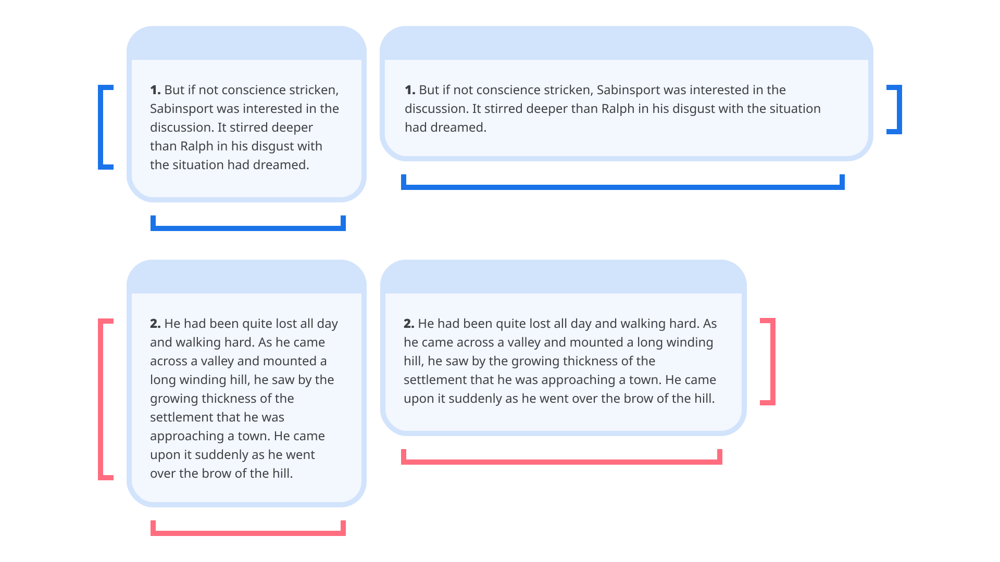
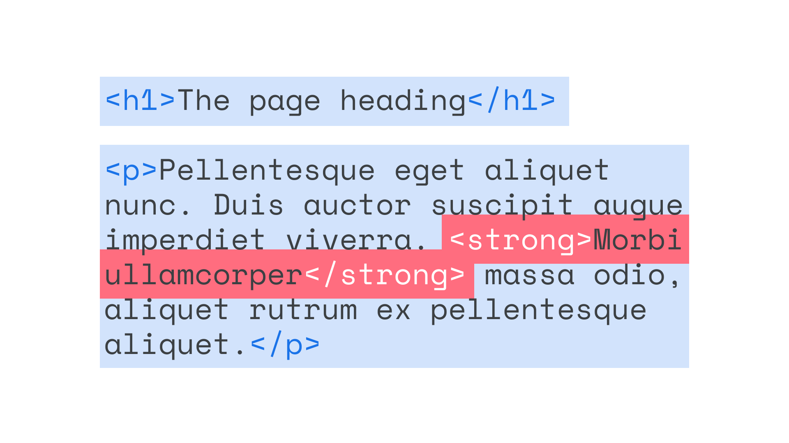
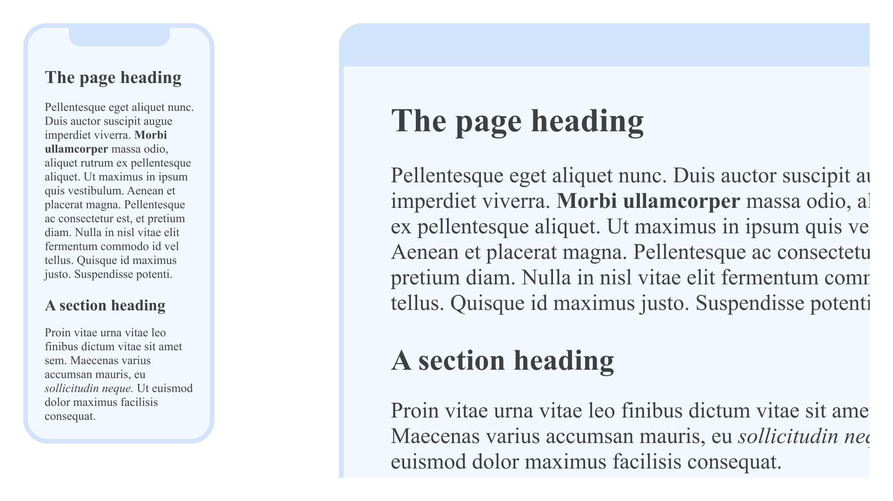
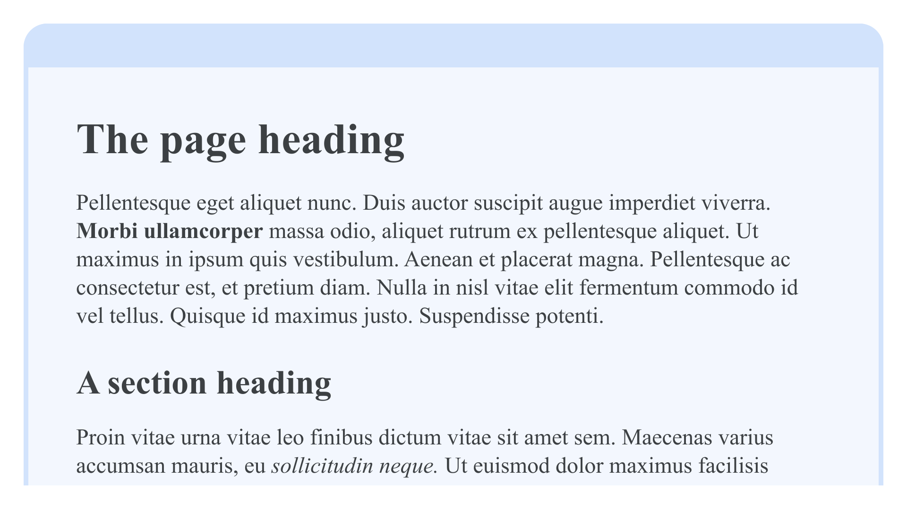
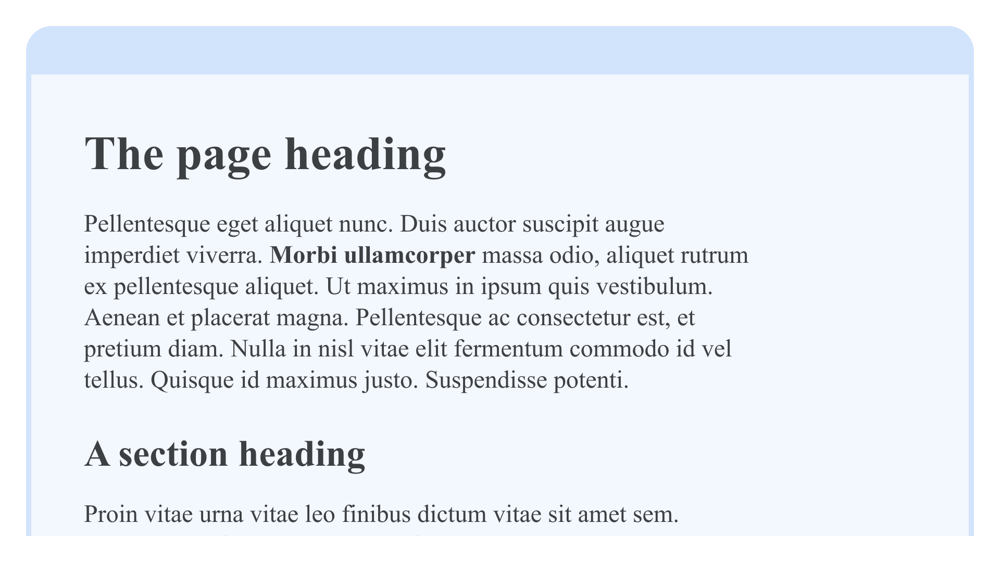
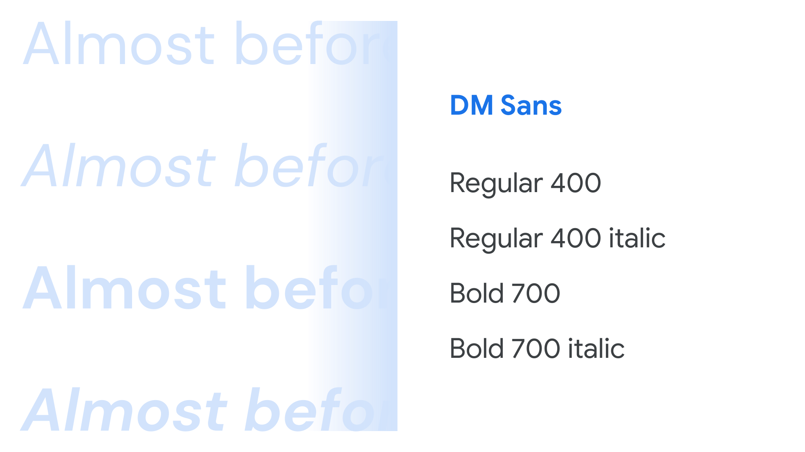

The internet is so entrenched in our everyday lives, it can be easy to forget that it’s a relatively young medium, and that reading [text](/glossary/text) on screen is actually a pretty new behavior. However, although web [typography](/glossary/typography) brings its own conventions, it’s based on long established practices of printed typography—a practice that has been evolving over the last several hundred years.

## Reading and writing on the web

There are two main reasons why web typography—and reading on-screen as a whole—differs from the world of printed media.
The first is that web pages are inherently fluid: Content will fill the viewport, whether it’s narrow or wide, and the vertical height of each web page is dictated by the content itself, whether short or long. This is in direct contrast to the world of printed media, where the constraints are fixed by the pages themselves, and content is forced to work within those fixed parameters. (In the early 00s, some web designers attempted to mirror this approach, with technologies like Flash, but returned to its naturally fluid roots with the arrival of smartphones that required [responsive web design](http://www.alistapart.com/articles/responsive-web-design/) in 2010.)

<figure>


<figcaption>The content naturally fills the width of the browser, and the height of the web page is dictated by the length of the content it contains.</figcaption>

</figure>

The second reason is that text flow is unpredictable, especially when a template design is finished before the text content is even written. Whether it’s a journalist writing a story in a newspaper website’s [CMS](https://en.wikipedia.org/wiki/Content_management_system), or a user leaving a comment on social media, there’s a limited notion of what the content actually is before it’s rendered on the page. This is unlike printed media, where content is edited to fit the page exactly, perhaps even being edited at a word-by-word level to make for a more harmonious appearance.

Different viewports, the often subtle differences between different devices and platforms, and the growth of user-generated content together represent the inherent flexibility of the web: a thoroughly modern challenge in terms of typography. But again, the way that we treat type on screen is based on the well-developed typographic practices honed over time, and the [typographer](/glossary/typographer)’s goal remains the same: Make text readable and carry the text’s message.

## A brief overview of HTML elements and hierarchy

HTML—the first language of web pages—gives us a number of elements to use when marking up content. Focussing on text specifically, we have the containing body element, as well as (six levels of) headings, paragraphs, blockquotes, and citations.

* `body`
* `h1` – `h6`
* `p`
* `blockquote`
* `cite`

All of these elements wrap around blocks of text, but we also have elements that can wrap around individual words or parts of text, from the core functionality of the link anchor `a` to the invisible `span`; or those more typographic in nature, most often used for emphasis:

* `a`
* `span`
* `strong`
* `em`

`strong` and `em`, like the heading elements, allow us to give more meaning to the text by providing further hierarchy and context. Both offer ways of differentiating certain parts of the text. And—assuming that the majority of our copy is set in a regular weight—the occasional word or phrase in a bold weight or italic style suggests emphasis, and therefore aids the reader in understanding the meaning of the text.

See our article [“Introducing weights & styles”](/lesson/introducing_weights_styles) for more information.

<figure>



</figure>

With text marked up structurally, it will become readable with a visual hierarchy in the browser’s default styles (i.e., without any of our own CSS) and be accessible to screen readers for users who make use of assistive technology.

For the sake of a basic demonstration, let’s assume we have a very simple HTML document that resembles the following:

```html
<!DOCTYPE html>
<html lang="en">
  <head>
    <meta charset="utf-8">
    <title>My example page</title>
  </head>
  <body>
    <h1>The page heading</h1>
<p>Pellentesque eget aliquet nunc. Duis auctor suscipit augue imperdiet viverra. <strong>Morbi ullamcorper</strong> massa odio, aliquet rutrum ex pellentesque aliquet. Ut maximus in ipsum quis vestibulum. Aenean et placerat magna. Pellentesque ac consectetur est, et pretium diam. Nulla in nisl vitae elit fermentum commodo id vel tellus. Quisque id maximus justo. Suspendisse potenti.</p>
    <h2>A section heading</h2>
<p>Proin vitae urna vitae leo finibus dictum vitae sit amet sem. Maecenas varius accumsan mauris, eu <em>sollicitudin neque</em>. Ut euismod dolor maximus facilisis consequat.</p>
  </body>
</html>
```

Paying attention to everything within the `body` element for now, what we have is a level one heading, followed by a paragraph of text, followed by a level two heading, and finally another paragraph. There’s a bit of text wrapped in a `strong` element in the first paragraph, and an element wrapped in `em` in the second.

<figure>



</figure>

## Web typography essentials with CSS

CSS is the second language we use to add typographic style and layout to HTML. It’s a large language, but everyone can learn the basics quickly from some simple examples. We can add CSS directly into the `head` of our HTML document inside a `style` element, but generally it’s best practice to put all of our CSS in a separate file (or files) and link to it, so that the styles can be used across multiple pages by linking them all to the same CSS file. To do that, we add this reference to a CSS file called `style.css` inside the `head` element:

```html
<link href="style.css" rel="stylesheet">
```

Now, working in that separate CSS file, it’s time to apply our own typography to our text. Sticking with [system fonts](/glossary/system_font_web_safe_font) rather than [web fonts](/glossary/web_font) for now, we’ll improve its overall appearance.

First, let’s increase the contrast in size between our headings and paragraph text:
body {
    font-size: 16px;
}
h2 {
    font-size: 150%;
}
h1 {
    font-size: 200%;
}
Now let’s make everything a bit more readable by opening up the line-height a bit:

```css
body {
    line-height: 125%;
}
```

(There are many units we can use for sizing type, but points and percentages work well for the purpose of this demonstration.)

If we look at the website on a phone or tablet, the text should look pretty good, but on a laptop or desktop screen, the [measure](/glossary/measure_line_length)—the length of each line of text—is far too wide, and it’s harder for our eyes to move from one line to the next.



Let’s counter this by adding a `max-width` value to the body element so that it doesn’t grow any wider than 20em:

```css
body {
    max-width: 20em;
}
```

We declare the width in a relative unit called ems, which is preferable to pixels because it enhances the inherent fluidity of the web medium. For an introduction to ems, see [Sizing Units](https://web.dev/learn/css/sizing/#relative-lengths) on web.dev. For more—a lot more—on CSS as a whole, see web.dev’s [“Learn CSS.”](https://web.dev/learn/css/)

<figure>


<figcaption>The content now stops becoming too wide on bigger viewports.</figcaption>

</figure>

## Using web fonts on websites

We’ve made a few subtle adjustments to improve the way our text looks; now, let’s add a little personality to it by changing the [typeface](/glossary/typeface) used on the page.

We’re going to go to Google Fonts, view the typeface [DM Sans](https://fonts.google.com/specimen/DM+Sans), and select the Regular, Regular Italic, Bold, and Bold Italic weights.

<figure>



</figure>

Then we’ll copy the CSS that appears in the drawer on the right and paste that into the head of our HTML:

```html
<link href="https://fonts.googleapis.com/css2?family=DM+Sans:ital,wght@0,400;0,700;1,400;1,700&display=swap" rel="stylesheet">
```

(You can read more about the specifics of this code on [Google Fonts’ CSS API update](https://developers.google.com/fonts/docs/css2) and learn about [best practices for fonts](https://web.dev/font-best-practices) on web.dev.)

Now the fonts are connected to our website, we can reference them in our CSS, like so:

```css
body {
    font-family: 'DM Sans', sans-serif;
}
```

This tells the browser to render all of the page’s text using the DM Sans font files served from Google Fonts, or fall back to the system’s default [sans serif](/glossary/sans_serif) typeface if the font files don’t load.

The browser’s default styles will render headings in bold fonts (i.e. with a `font-weight` of 700), but to demonstrate how we can alter that, let’s tweak our CSS so that the `h1` element actually uses the Regular (400) weight:

```css
h1 {
    font-weight: 400;
}
```

Note that the Bold (700) weight font will be used for the `h2` element and any text in the paragraph that’s marked up with `strong`. The Regular (400) weight Italic font will be used for any text in the paragraph that’s marked up with `em`.

<figure>


</figure>

Note: It’s usually worth getting the Bold (700) Italic font file to avoid any scenarios where type styles might be incorrectly synthesized by the browser, such as when an editor might want text to be bold and italic (perhaps by adding an em around a word inside an h2 element).

## Self-hosting web fonts

If you’d prefer to host the web fonts you use on your own server, every font in the Google Fonts library is available to download. Self-hosting is also an option if fonts simply aren’t available on Google Fonts or your font delivery service of choice. We’ve prepared a quick guide on [“Self-hosting web fonts”](/lesson/self_hosting_web_fonts).

## Optimizing the performance of web fonts

It’s worth remembering that web fonts, just like all website assets, are resources that the browser downloads to a user’s computer, tablet, or phone when fetching a website; therefore, just as page loading times are affected by the file size of images used on a website, they're also affected by the size of the font files.

At the simplest level, this is a valid argument for using only a small number of typefaces in our designs, but also it means limiting the number of weights and styles used within those type families to save on file size. This is a core advantage of [variable fonts](/glossary/variable_fonts): If we’re using multiple weights and styles, all of them are contained in only one or two files—and that file is almost always considerably smaller than downloading many individual font files.

There’s more that we can do to optimize our web fonts, however. We can avoid a [flash of invisible text](/glossary/foit)—when a web page loads without the type appearing at all, before rendering to the intended typeface—and any undesirable re-rendering by combining `<link rel="preload">` with `font-display: optional`. You can read more about this technique on the web.dev articles [“Prevent layout shifting and flashes of invisible text (FOIT) by preloading optional fonts”](https://web.dev/preload-optional-fonts/) and [“Optimize WebFont loading and rendering”](https://web.dev/optimize-webfont-loading/).
