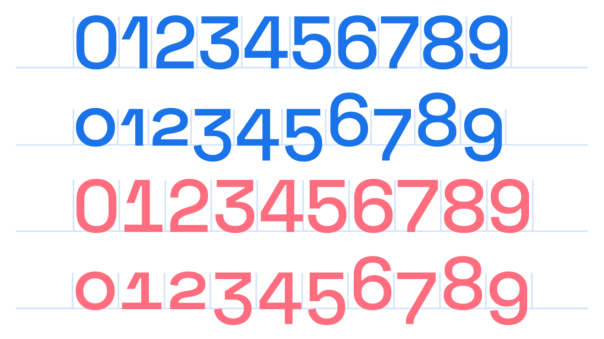

Before we get going with any article to do with [tracking](/glossary/tracking_letter_spacing), let’s make sure we’re definitely talking about tracking and not [kerning](/glossary/kerning_kerning_pairs): Tracking is the overall value given to letter spacing (it’s even called `letter-spacing` in CSS), whereas kerning is concerned specifically about the space between two [glyphs](/glossary/glyph) as a pair.

<figure>

<figcaption>Too tight, just right, and too open.</figcaption>

</figure>

Because tracking is a manual adjustment made to [type](/glossary/type), it should be approached with a great deal of caution—we’re essentially going against the intentions of the [type designer](/glossary/type_designer), who’s already thoughtfully spaced everything within the [font](/glossary/font). Hence the title of this article, "Track carefully or not at all."

Generally speaking, there are three simple rules you can follow when tracking type:

1. Add a more open (i.e., higher) tracking value to [all-caps](/glossary/all_caps) or [small caps](/glossary/small_caps) type, especially at smaller (i.e., [body](/glossary/body)) sizes.
2. Never track too widely. (Don’t make the user think about the word they’re reading.)
3. [Display](/glossary/display) sizes often benefit from a little negative tracking and very small text often benefits from positive tracking.

<figure>

![A montage of examples to illustrate changes to letter spacing. In the first example, the word “UNESCO” in the sentence, set in small caps, is given some additional tracking, with the default setting shown faintly beneath it. In the next, a bad example is shown of text with tracking that is too wide. In the third, a paragraph of very small type is given more letter spacing to aid readability. Again, the default setting is shown faintly alongside. In very large text, the word “Big” is shown with some negative tracking applied, with the default setting visible beneath.](images/thumbnail.svg)

</figure>

You’ll find that there are many articles on **Google Fonts Knowledge** that deal with the visual effects inherent within typography, and tracking is no exception. This is because, for clusters of type set at a different font sizes, it’s necessary to *change* their tracking values in order for them to feel the same.

In his article [“Typography is Impossible,”](https://medium.engineering/typography-is-impossible-5872b0c7f891) Marcin Wichary says that “type is aligned when it feels aligned, not when it actually is aligned.” To illustrate his point he sets a line of type at a font size of 50px and another at 500px. To get them to feel the same, he gives the small text a tracking value of -30 and the large text a tracking value of -60. From this example he not only illustrates the requirement for us as [typographers](/glossary/typographer) to cheat the system in order for the text to be more readable, but also concludes:

> If it needs to become –60 to feel right, it means one thing: Letter spacing gets tighter much faster than the font size gets bigger.
>

## Tracking numerals & ligatures

Special care should be given to tracking when working with [numerals](/glossary/numerals_figures) and [ligatures](/glossary/ligature) because these types of characters already have special considerations related to spacing.

Numerals usually have [tabular or proportional options](/lesson/understanding_numerals)—accessed via [OpenType](/glossary/open_type)—to allow for vertical alignment in tables (in the former) or alignment within body text (in the latter), so it’s important to make sure we’re using the correct kind of numerals before attempting any tracking.

<figure>

</figure>

Similarly, ligatures are glyphs designed (usually) to tackle awkward conflicts around spacing. One of the most well-known ligatures, ff, attempts to prevent a clash between the two f characters.

<figure>

</figure>

Ligatures can make tracking and kerning tricky because we can’t alter the spacing between the two letters that make up a ligature’s glyph, so it’s advisable to disable ligatures if we’re applying a more open tracking.
