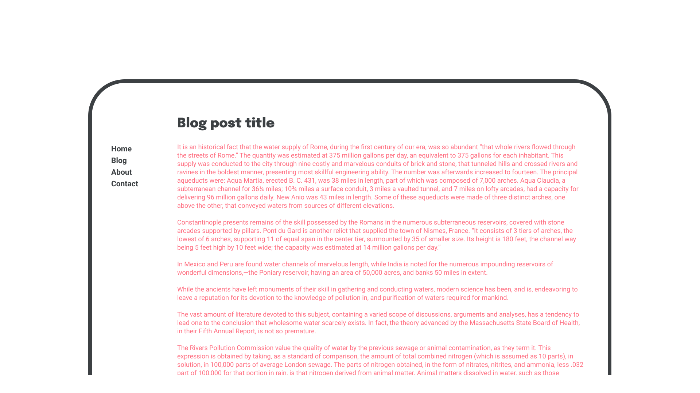
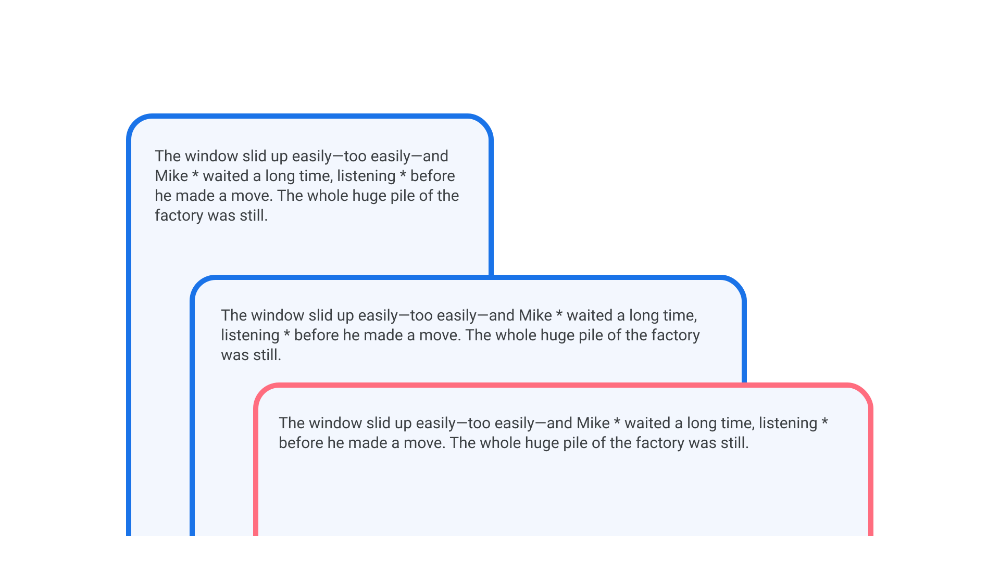

[Measure, or line length](/glossary/measure_line_length), is something that is so often overlooked when setting [type](/glossary/type)—especially on screens, since text on the web is inherently more flexible. When [responsive web design](https://en.wikipedia.org/wiki/Responsive_web_design) arrived on the scene in 2011, early adopters (who had mainly been using fixed widths for their content blocks like they used in print) were suddenly able to refactor their designs to great effect. But this introduced a new problem: unwieldy line lengths.

<figure>



</figure>

Of course, the web is a fluid medium by default, and content absolutely *should* be allowed to re-flow however required, according to the viewport size and the user’s needs. But there are certain things we can do as [typographers](/glossary/typographer) to tame that potentially chaotic re-flow and offer users an optimal reading experience.

Although personal opinions may differ and recommendations will depend on the actual size of the [font](/glossary/font) (and specifically the [width](/glossary/width) of the [characters](/glossary/character), including spaces), “anything from 45 to 75 characters is widely regarded as a satisfactory length of line for a single-column page set in a serifed text face in a text size,” said Robert Bringhurst, in his book, “The Elements of Typographic Style.” The [Material Design guidelines](https://material.io/design) suggest “between 40 to 60 characters” as a suitable measure for [body](/glossary/body) [text](/glossary/text_copy) on screen. In English texts, approximately—*very* approximately—10 words work quite well. Again, it depends, but this sort of range serves as a useful starting point.

<figure>


<figcaption>The first paragraph’s measure is very short, but suitable for micro-copy; the second is too short for standard paragraph text; the third is about right; the fourth is too long.]</figcaption>

</figure>

Now, no one expects even the most ardent typographer to count the characters in every line of their text—especially on the web. Back in 2012, shortly after Responsive Web Design produced all those uncomfortably long measures, [Trent Walton devised a simple technique](https://trentwalton.com/2012/06/19/fluid-type/) for keeping your eye on an optimum measure, and one that can be especially handy if we find it hard to judge what “feels” right: Simply place an asterisk at character 45 and character 75, and add in a new media query every time the two asterisks appear together on the first line:

<figure>



</figure>

As for what that media query then does is up to the individual designer. Trent recommends changing either the width of the container or the font size itself. A combination of both has served your faithful author well for many years now. Here’s a simplified approximation of this technique:

```
tiny screen {
	text: SMALL font size
	container: SMALL container width
}

small screen {
	text: SMALL font size
	container: MEDIUM container width
}

medium screen {
	text: MEDIUM font size
	container: MEDIUM container width
}

big screen {
	text: LARGE font size
	container: MEDIUM container width
}

huge screen {
	text: LARGE font size
	container: LARGE container width
}
```

To illustrate this, consider the following image. The left-most and narrowest viewport uses the default font size. The next viewport is wider, but the asterisks still sit on different lines, so there’s no need to change any values. Then, once the viewport widens, the font-size is increased. The final and widest viewport keeps this new font size intact, but reduces the size of the text’s containing element.

<figure>


</figure>

In reality, it doesn’t necessarily make sense to increase our font size *and* the text’s containing element at the same time, so it’s advisable to keep these media queries in separate places in your CSS files and adjust as needed.

Plus, it’s not only these two elements that come into consideration when seeking the optimal measure: Let’s not forget about [leading (or line height)](/glossary/line_height_leading). [As our measure grows wider, so too should our leading become larger](/lesson/choosing_a_suitable_line_height), to aid the reader as they move between lines down the page. Cyrus Highsmith suggests in his book, “Inside Paragraphs,” that word space should also be considered alongside line height and measure as a dependancy for all three.
