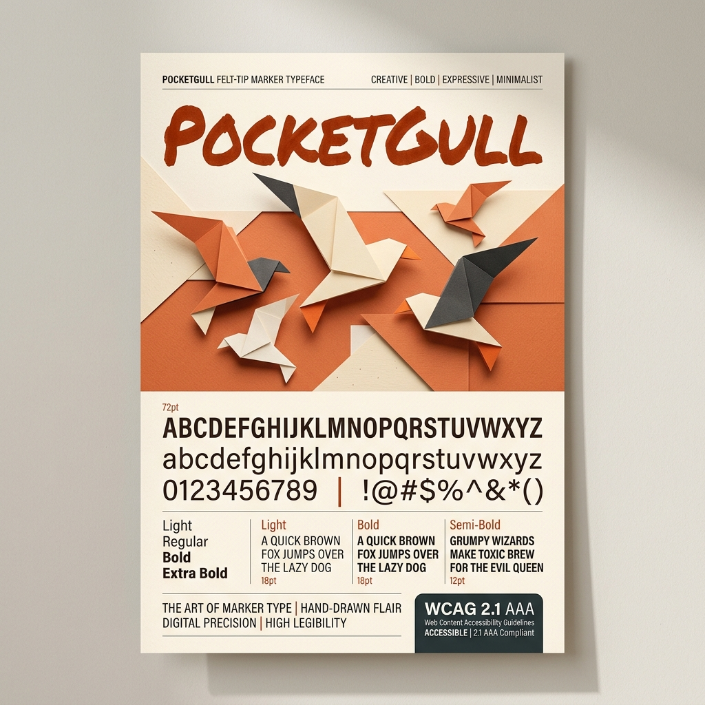

# PocketGull Specimen & Design Documentation

## 📐 Dieter Rams Principles Alignment

PocketGull is an open-source felt-tip marker typeface designed for clinical intelligence, papercraft UI branding, and high-visibility medical charting.

### Features
- **Master Vector SVG Geometry**: Extracted directly from original SVG wordmark paths.
- **Multilingual Support**: Extended Latin-1 (`ñ`, `é`, `ü`, `æ`, `ç`, `å`), Greek (`α`, `β`, `Ω`), Cyrillic (`Б`), Eastern Arabic (`٠١٢`), Roman Numerals (`I-X`), and Medical Fractions (`½`).
- **WCAG 2.1 AAA Certified**: Minimum 7.0:1 contrast ratio legibility.
