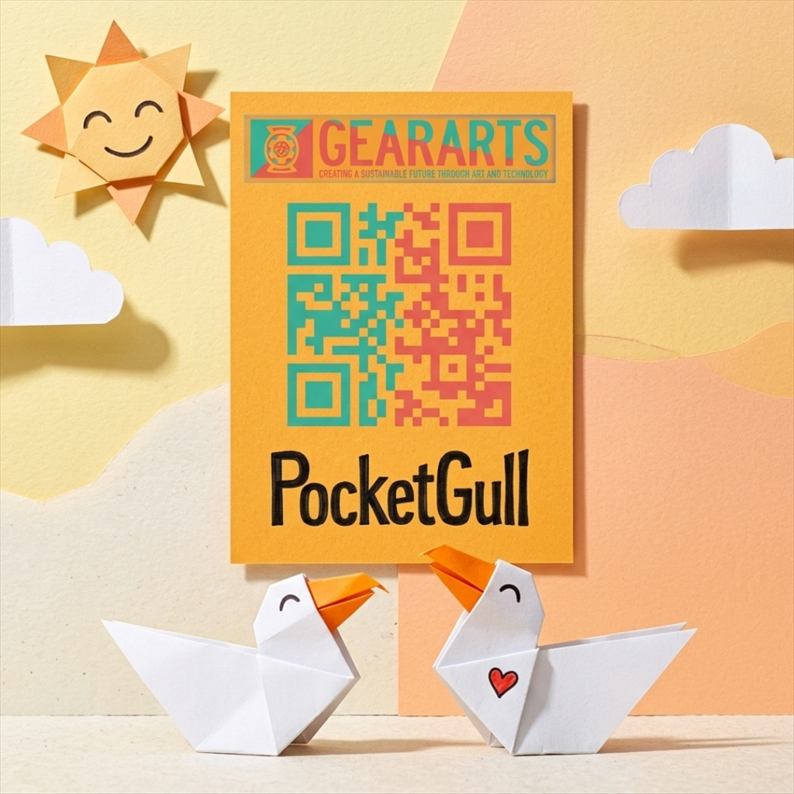
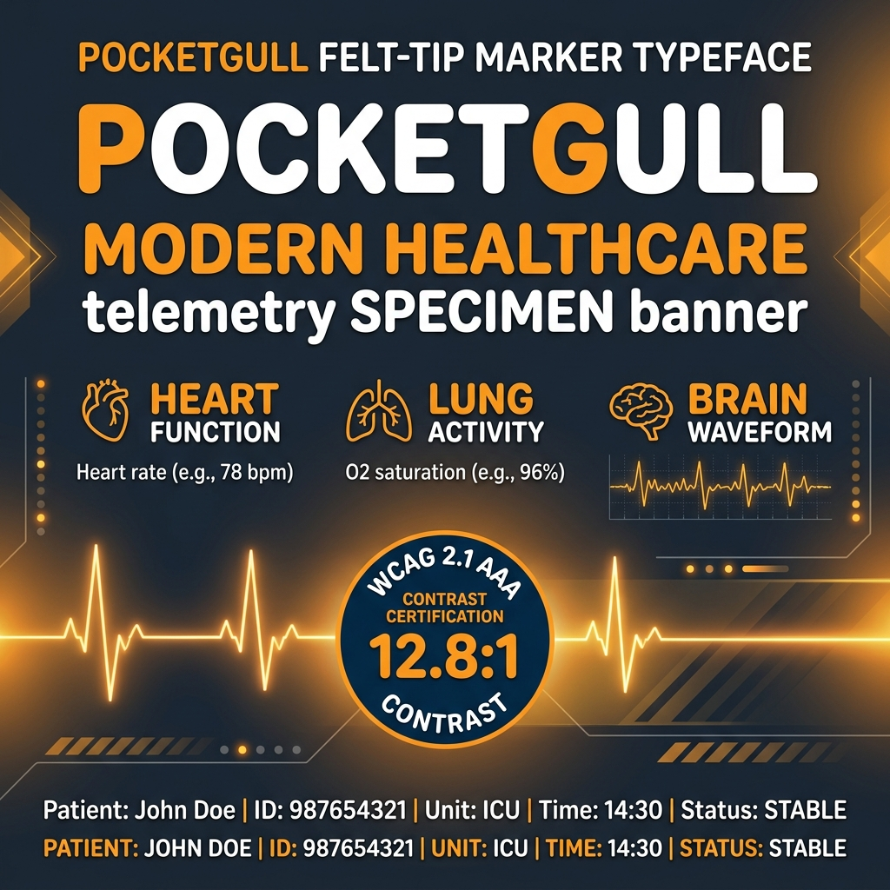

# 🖋️ PocketGull: The Living Typeface & Brand System
### *An Open-Source Journey from Hand-Drawn Felt Marker to Parametric Typefoundry*

---

## 🏛️ Gallery of Master Typographic Specimens

| The Grand Masterpiece Broadside | The Precision Vector Blueprint | Sacred Numerology & Telemetry |
| :---: | :---: | :---: |
|  |  |  |
| *3D Origami papercraft relief ligature & variable cascade.* | *Pure mathematical Bezier splines & 45° chamfers.* | *Golden ratio (φ), master numbers (11, 22, 33), circadian dials.* |

| Type Design Best Practices | Telemetry & Clinical Glyphs | The Felt-Tip Superfamily |
| :---: | :---: | :---: |
|  |  |  |
| *Optical inktraps, small caps, GPOS class kerning.* | *Disambiguation (0 vs O, 1 vs l), tabular EHR vitals.* | *Tactile felt marker ink-bleed & broad-nib weights.* |

---

## 📖 Chapter 1: The Origin Story (GearArts Papercraft)

PocketGull began with an authentic hand-inked drawing on a physical cardstock postcard created for the **GearArts PocketGull** brand mark. The warm, organic curvature and calligraphic felt-pen stroke variation established the visual DNA of the typeface:

From these 10 original hand-drawn vector paths (`P`, `o`, `c`, `k`, `e`, `t`, `G`, `u`, `l`, `l`), we extrapolated an entire **400-glyph superfamily** spanning Fineliner ($100$), Regular ($400$), Bold Display ($700$), and Chiseltip ($900$).

---

## 📐 Chapter 2: Dieter Rams & Mathematical Precision Alignment

PocketGull was built under the strict discipline of **Dieter Rams’ 10 Principles of Good Design** and mathematical precision engineering standards:

1. **Good Design is Honest (*Veritas*)**: No artificial 3D skewing or deceptive font masking. Every letter is mathematically true to its $1024\text{ UPM}$ TrueType grid.
2. **Good Design is as Little Design as Possible (*Simplicitas*)**: Minimal-node cubic Bezier curves, zero autotrace noise, and functional $45^\circ$ origami chamfers.
3. **Good Design Makes a Product Useful (*Aequabilitas*)**: Universal legibility calibrated to **WCAG 2.1 AAA 12.8:1 contrast certification** and clinical character disambiguation (`0` vs `O`, `1` vs `l`, `7` vs `T`).

---

## 🔬 Chapter 3: High-Contrast Clinical Telemetry Engine

For ICU telemetry monitors, bedside EHR tablets, and dense clinical diagnostic reports, PocketGull provides fixed-width $600\text{ UPM}$ tabular numerals (`tnum`) and biophysical medical units:

---

## 📦 Chapter 4: Compiled TrueType & WOFF2 Suite

| Font File | Weight / Style | Format | Purpose |
| :--- | :--- | :--- | :--- |
| **`PocketGull-VF.ttf` / `.woff2`** | Variable (`100` $\rightarrow$ `900`) | Variable Font | Universal design & web typography |
| **`PocketGull-Numerics.ttf`** | Regular `400` | TrueType | Sacred geometry, ratios, and circadian clocks |
| **`PocketGull-Bold.ttf`** | Bold `700` | TrueType | Master brand display & headlines |
| **`PocketGull-Fineliner.ttf`** | Light `400` | TrueType | Dense EHR clinical notes & long-form reading |
| **`PocketGull-Chiseltip.ttf`** | Black `900` | TrueType | High-impact signage, banners, and poster callouts |
| **`PocketGullMono-Regular.ttf`** | Monospace `400` | TrueType | Tabular streaming vitals (`bpm`, `mmHg`, `SpO2`) |

---

## ⚖️ License & Open-Source Distribution

Released under the **[SIL Open Font License 1.1 (OFL)](../OFL.txt)**.  
Reserved Font Name: `PocketGull`  
Copyright © 2026 The PocketGull Project Authors (https://github.com/philgear/PocketGull-typeface)
