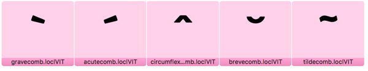
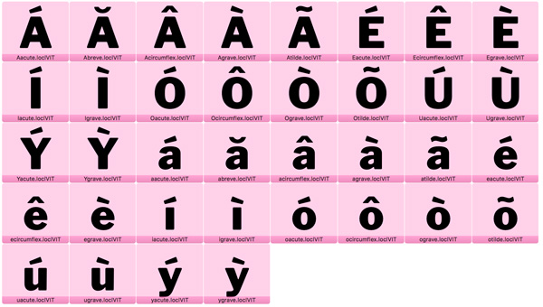
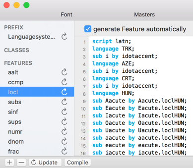

### Making Vietnamese look better

####How to create localized Vietnamese glyphs, different from default Latin in Glyphs App


First, let's create glyphs for localized Vietnamese accents. Go to `Glyphs > Add Glyphs`, copy and paste the command below:


```
acutecomb=acutecomb.loclVIT
gravecomb=gravecomb.loclVIT
circumflexcomb=circumflexcomb.loclVIT
brevecomb=brevecomb.loclVIT
tildecomb=tildecomb.loclVIT
```



Adjust the new accents to your liking. Then add localised Vietnamese glyphs with the next command. Go to `Glyphs > Add Glyphs`, copy and paste the code below:

```
A+acutecomb.loclVIT=Aacute.loclVIT
E+acutecomb.loclVIT=Eacute.loclVIT
I+acutecomb.loclVIT=Iacute.loclVIT
O+acutecomb.loclVIT=Oacute.loclVIT
Ohorn+acutecomb.loclVIT=Ohornacute
U+acutecomb.loclVIT=Uacute.loclVIT
Uhorn+acutecomb.loclVIT=Uhornacute
Y+acutecomb.loclVIT=Yacute.loclVIT
a+acutecomb.loclVIT=aacute.loclVIT
e+acutecomb.loclVIT=eacute.loclVIT
idotless+acutecomb.loclVIT=iacute.loclVIT
o+acutecomb.loclVIT=oacute.loclVIT
ohorn+acutecomb.loclVIT=ohornacute
u+acutecomb.loclVIT=uacute.loclVIT
uhorn+acutecomb.loclVIT=uhornacute
y+acutecomb.loclVIT=yacute.loclVIT

A+gravecomb.loclVIT=Agrave.loclVIT
E+gravecomb.loclVIT=Egrave.loclVIT
I+gravecomb.loclVIT=Igrave.loclVIT
O+gravecomb.loclVIT=Ograve.loclVIT
Ohorn+gravecomb.loclVIT=Ohorngrave
U+gravecomb.loclVIT=Ugrave.loclVIT
Uhorn+gravecomb.loclVIT=Uhorngrave
Y+gravecomb.loclVIT=Ygrave.loclVIT
a+gravecomb.loclVIT=agrave.loclVIT
e+gravecomb.loclVIT=egrave.loclVIT
idotless+gravecomb.loclVIT=igrave.loclVIT
o+gravecomb.loclVIT=ograve.loclVIT
ohorn+gravecomb.loclVIT=ohorngrave
u+gravecomb.loclVIT=ugrave.loclVIT
uhorn+gravecomb.loclVIT=uhorngrave
y+gravecomb.loclVIT=ygrave.loclVIT

A+circumflexcomb.loclVIT=Acircumflex.loclVIT
A+circumflexcomb.loclVIT+dotbelowcomb=Acircumflexdotbelow
E+circumflexcomb.loclVIT=Ecircumflex.loclVIT
E+circumflexcomb.loclVIT+dotbelowcomb.loclVIT=Ecircumflexdotbelow
O+circumflexcomb.loclVIT=Ocircumflex.loclVIT
O+circumflexcomb.loclVIT+dotbelowcomb=Ocircumflexdotbelow
a+circumflexcomb.loclVIT=acircumflex.loclVIT
a+circumflexcomb.loclVIT+dotbelowcomb=acircumflexdotbelow
e+circumflexcomb.loclVIT=ecircumflex.loclVIT
e+circumflexcomb.loclVIT+dotbelowcomb=ecircumflexdotbelow
o+circumflexcomb.loclVIT=ocircumflex.loclVIT
o+circumflexcomb.loclVIT+dotbelowcomb=ocircumflexdotbelow

A+brevecomb.loclVIT=Abreve.loclVIT
A+brevecomb.loclVIT+dotbelowcomb=Abrevedotbelow
a+brevecomb.loclVIT=abreve.loclVIT
a+brevecomb.loclVIT+dotbelowcomb=abrevedotbelow

A+tildecomb.loclVIT=Atilde.loclVIT
E+tildecomb.loclVIT=Etilde
I+tildecomb.loclVIT=Itilde
Ohorn+tildecomb.loclVIT=Ohorntilde
O+tildecomb.loclVIT=Otilde.loclVIT
Uhorn+tildecomb.loclVIT=Uhorntilde
U+tildecomb.loclVIT=Utilde
Y+tildecomb.loclVIT=Ytilde
a+tildecomb.loclVIT=atilde.loclVIT
e+tildecomb.loclVIT=etilde
idotless+tildecomb.loclVIT=itilde
ohorn+tildecomb.loclVIT=ohorntilde
o+tildecomb.loclVIT=otilde.loclVIT
uhorn+tildecomb.loclVIT=uhorntilde
u+tildecomb.loclVIT=utilde
y+tildecomb.loclVIT=ytilde
```

This command will create new unique Vietnamese glyphs with special accents, and generate additional localized variants for these glyphs:

```
Aacute.loclVIT Abreve.loclVIT Acircumflex.loclVIT Agrave.loclVIT Atilde.loclVIT Eacute.loclVIT Ecircumflex.loclVIT Egrave.loclVIT Iacute.loclVIT Igrave.loclVIT Oacute.loclVIT Ocircumflex.loclVIT Ograve.loclVIT Otilde.loclVIT Uacute.loclVIT Ugrave.loclVIT Yacute.loclVIT Ygrave.loclVIT aacute.loclVIT abreve.loclVIT acircumflex.loclVIT agrave.loclVIT atilde.loclVIT eacute.loclVIT ecircumflex.loclVIT egrave.loclVIT iacute.loclVIT igrave.loclVIT oacute.loclVIT ocircumflex.loclVIT ograve.loclVIT otilde.loclVIT uacute.loclVIT ugrave.loclVIT yacute.loclVIT ygrave.loclVIT
```




Now update your `locl` OT feature.




Other glyphs are unique for Vietnamese within the GF Latin glyphs sets range, they will be created with special Vietnamese accents. 


*Written by Alexei Vanyashin* [@alexeiva](https://github.com/alexeiva)

Acknowledgments: Nhung Nguyen [@crystaltype](https://github.com/crystaltype) for the idea

