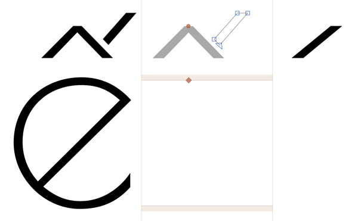

Recommended additions 
===
to [Google Fonts 2016 Glyph Sets](README.md)

Although **Plus, Pro and Expert** sets provide extensive language coverage there may be particular design cases where additional characters would be helpful to have. 

Here is a list of popular ligatures that are recommended for addition on a case-to-case basis:

	f_b
	f_f_b
	f_h
	f_f_h
	f_j
	f_f_j
	f_k
	f_f_k
	f_t
	f_f_t
	c_k
	c_p
	e_t
	l_l
	s_p
	t_h
	t_t
	t_z

	
***
### Space Characters


[Space Characters Design Standards — Microsoft Typography](1)

### Better Components Generation in Glyphs ###

By adding the following glyphs, you will enable auto-generation of many components for the GF Latin encodings.

```
DZ
Dz
dz
slashlongcomb
slashshortcomb

```

### Armenian Dram ###

Armenian Dram currency symbol is a recommended addition to any Cyrillic-supporting fonts, due to popular use of Russian in Armenia.

	0x058F  ֏ dram-arm


### Better Vietnamese ###

Stacked Vietnamese accents may require custom tailoring. This can be achieved by adding additional accents. Glyphs will automatically place these newly created accents were applicable. 

Image: `ecircumflexacute`, `circumflexcomb_acutecomb` and `acutecomb`




Recommended glyphs for better Vietnamese diacritics. 

```
brevecomb_acutecomb
brevecomb_gravecomb
brevecomb_hookabovecomb
brevecomb_tildecomb
circumflexcomb_acutecomb
circumflexcomb_gravecomb
circumflexcomb_hookabovecomb
circumflexcomb_tildecomb
```

*Further reading:* [Customized Vietnamese accents](Vietnamese/README.md)

### Polish Kreska ###

Polish Kreska shares the same unicode as the acute accent, however it is designed differently. Explore Adam Twardoch's guidelines on [Polish Kreska](2)

Here is a list of additional glyphs for better Polish support:

```
Cacute.loclPLK Nacute.loclPLK Oacute.loclPLK Sacute.loclPLK Zacute.loclPLK cacute.loclPLK nacute.loclPLK oacute.loclPLK sacute.loclPLK zacute.loclPLK acutecomb.loclPLK acutecomb.loclPLK.case
```

### STRASSE or Straße? ###

The Google Lating Plus encoding includes **ẞ Germandbls U+1E9E**. 

Does your font include Small Capitals?
For better compatibility you may consider adding the germandbls.calt glyph to access ẞ U+1E9E in Small Caps fonts. In Glyphs go to *Glyph > Add Glyphs*, and paste this code:

```
Germandbls=germandbls.calt
```
	
Add this calt feature:

```
sub @Uppercase germandbls' @Uppercase by germandbls.calt;
sub @Uppercase @Uppercase germandbls' by germandbls.calt;
```

### Duodecimal(dozenal) notation

Add these glyphs for single-digit representations of numbers 10 and 11.

```
U+218A (turned digit two) 
U+218B (turned digit three)
```

Recommended links for further reading: 

 * [How to draw a Capital Sharp S](https://typography.guru/journal/how-to-draw-a-capital-sharp-s-r18/) by Ralf Herrmann

 * [Localize Your Font: German Capital Sharp S](https://www.glyphsapp.com/tutorials/localize-your-font-german-capital-sharp-s) by Rainer Erich Scheichelbauer  

N.B. The question of German Uppercase Capital Sharp S is still highly debatable, and its usage hasn't passed into the official orthography. 
### Cyrillic component building

These glyphs are used for component building and are non-exportable. Don't forget to set the non-export tag.

```
descender-cy
descender-cy.case
verticalbar-cy
verticalbar-cy.case
```

### Recommended links: ###

Pablo Impallari's [Latin encoding](https://github.com/impallari/Impallari-Fontlab-Encodings/tree/master/Impallari%20Latin)

[1]:https://www.microsoft.com/typography/developers/fdsspec/spaces.htm
[2]:http://www.twardoch.com/download/polishhowto/kreska.html