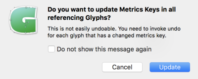

Troubleshooting List Filters
===
back to [Google Fonts 2016 Glyph Sets README.md](README.md)

You are adding new glyphs to your font, and you may get this error:

Say, you are trying to add `DZcaron`, but the font already includes the same glyph with a different name `uni01C4`. The FilterLists are fully compatible with the Glyphs naming scheme. So, for a seamless workflow we advise changing the glyph name in the existing font to follow the same convention. To do this you would need to Update Glyph Info by following these steps.

Step 1.  Open Font *Info > Other Settings*. Make sure `Use custom naming` is unchecked.

Step 2.	Select all glyphs, from the top menu choose *Glyphs > Update Glyph Info*.
You might get this message. Click Update. 

 

Step 3. Now your glyphs should all appear in the list filer

***

### Recommended links: ###

* [Glyphs App Forum](https://forum.glyphsapp.com)

* [Glyphs Handbook 2.2](https://glyphsapp.com/content/1-get-started/2-manuals/1-handbook-glyphs-2-0/Glyphs-Handbook-2.2.pdf)
