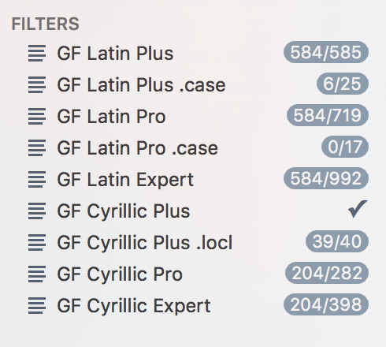

## Glyphs App Tips 


#### List Filters for GF Encodings
To create list filters for all new GF Encodings in one batch, you can copy this [*CustomFilter.plist*](Glyphs/CustomFilter.plist) file to your local *~/Library/Application Support/Glyphs/* folder. Copying this file will rewrite your old list filters. If you have filters you wish to keep, you can merge the two files, or add list filters manually as described in the [README.md](../README.md)



#### Custom GlyphsData XML for Cyrillic

This custom GlyphsData XML file tells Glyphs what components should be placed for newly created Cyrillic Plus glyphs. It will greatly speed up your process. You need to place [*CustomFilter.plist*](Glyphs/CustomFilter.plist) in your *~/Library/Application Support/Glyphs/Info* folder. If you don't have an *Info* folder: create it.

After copying custom List Filters, and GlyphsData XML your directory structure will look similar to this:


#### for GF Latin Glyph Sets


Are you seeing empty cells in your newly generated glyphs?

You can speed up your work by pasting in components to rapidly start your work. To generate new glyphs press *⌘-G* and paste in the respective code. If the chacaters already exist, choose *'replace'* from the popup menu. This will recreate your exising glyphs with components. 

```
N.B. Using starting components will speed up your workflow. However the result will only be a starting point for the final design.

```


*GF Latin Plus*

To get:  |  *⌘-G*, Paste this code: | 
------------ | ------------- | 
Lining Figures | zero=zero.lf one=one.lf two=two.lf three=three.lf four=four.lf five=five.lf six=six.lf seven=seven.lf eight=eight.lf nine=nine.lf |
Currencies | C+slash+slash=colonsign N+macron=naira P+macron=peseta W+macron=won d+macron+macron=dong K+macron=kip P+macron+macron=peso G+bar=guarani C+bar=cedi R+equal=rupeeIndian L+equal=liraTurkish bar=manat P+macron=ruble |
ẞ | germandbsl=Germandbls
ĸ | k=kgreenlandic
Ŋ ŋ DŽ Dž dž| N+J=Eng n+j=eng D+Z+caroncomb=DZcaron D+z+caroncomb=Dzcaron d+z+caroncomb=dzcaron  

*GF Latin Pro*

To get:  |  *⌘-G*, Paste this code: | 
------------ | ------------- | 
Numerators from Lining Figures | zero=zero.numr one=one.numr two=two.numr three=three.numr four=four.numr five=five.numr six=six.numr seven=seven.numr eight=eight.numr nine=nine.numr
Denominators from Numerators | zero.numr=zero.dnom one.numr=one.dnom two.numr=two.dnom three.numr=three.dnom four.numr=four.dnom five.numr=five.dnom six.numr=six.dnom seven.numr=seven.dnom eight.numr=eight.dnom nine.numr=nine.dnom


There are two methods for generating Scientific Inferiors and Subscript Figures.
*[Further Reading (Glyphs website)](https://www.glyphsapp.com/tutorials/superscript-and-subscript-figures)*

**Recommended Method** If you want a different design for Scientific Inferiors and Subscript Figures, add a set of .sinf figures, and paste in this code to generate components. As a result, your Subscript Figures *(oneinferior)* will have unicode values, while Scientific Inferiors *(one.sinf)* will not. 

To get:  |  *⌘-G*, Paste this code: | 
--- | --- |
Subscript Figures *(with Unicode)* | zero.numr=zeroinferior one.numr=oneinferior two.numr=twoinferior three.numr=threeinferior four.numr=fourinferior five.numr=fiveinferior six.numr=sixinferior seven.numr=seveninferior eight.numr=eightinferior nine.numr=nineinferior |
Scientific Inferiors (no unicode)| zeroinferior=zero.sinf oneinferior=one.sinf twoinferior=two.sinf threeinferior=three.sinf fourinferior=four.sinf fiveinferior=five.sinf sixinferior=six.sinf seveninferior=seven.sinf eightinferior=eight.sinf nineinferior=nine.sinf |

**Easy Method** If you want your Scientific Inferiors and Subscript Figures to match, rename all glyphs ending with *inferior* to *.subs* (i.e. *oneinferior > one.subs*). Glyphs will then autogenerate both .sinf and .subs features with identical characters. However, the figures will not have any unicode values. 

To get:  |  *⌘-G*, Paste this code: | 
--- | --- |
Scientific Inferiors and Subscript *(no unicode)* | zero.numr=zero.subs one.numr=one.subs two.numr=two.subs three.numr=three.subs four.numr=four.subs five.numr=five.subs six.numr=six.subs seven.numr=seven.subs eight.numr=eight.subs nine.numr=nine.subs |


#### for GF Cyrillic Glyph Sets

Most of Cyrillic glyphs will already have starting components, if you include the special [GlyphData-GFCyrillic.xml](Cyrillic/GlyphData-GFCyrillic.xml) 
There may be certain glyphs that reqiure manual actions.

*GF Cyrillic Plus*


To get:  |  *⌘-G*, Paste this code: | 
------------ | ------------- | 
ҽ | e+breve=cheabkhasian-cy |
Ҥ ҥ| En-cy+Ge-cy=Enghe-cy en-cy+ge-cy=enghe-cy |
Ҧ ҧ | Pe-cy+Dje-cy=Pemiddlehook-cy pe-cy+dje-cy=pemiddlehook-cy  |


*GF Cyrillic Plus: Localised variants*


*localised Variants in Poiret One*

Paste this code to quickly build starting components for you localised glyph variants.


To get:  |  *⌘-G*, Paste this code: | 
------------ | ------------- | 
Bulgarian | De-cy=De-cy.loclBGR Ii-cy=Ii-cy.loclBGR Iishort-cy=Iishort-cy.loclBGR Iigrave-cy=Iigrave-cy.loclBGR El-cy=El-cy.loclBGR Ef-cy=Ef-cy.loclBGR ve-cy=ve-cy.loclBGR s=ge-cy.loclBGR g=de-cy.loclBGR zhe-cy=zhe-cy.loclBGR ze-cy=ze-cy.loclBGR u=ii-cy.loclBGR u+brevecomb-cy=iishort-cy.loclBGR ugrave=iigrave-cy.loclBGR k=ka-cy.loclBGR el-cy=el-cy.loclBGR en-cy=en-cy.loclBGR n=pe-cy.loclBGR m=te-cy.loclBGR u+descender-cy=tse-cy.loclBGR che-cy=che-cy.loclBGR m=sha-cy.loclBGR m+descender-cy=shcha-cy.loclBGR |
Serbian (Roman)| be-cy=be-cy.loclSRB
Serbian (Italic) | imacron=ge-cy.loclSRB eth=de-cy.loclSRB n=pe-cy.loclSRB m=te-cy.loclSRB |
Macedonian | ge-cy.loclSRB+acutecomb=gje-cy.loclMKD |
Bashkir | F=Ghestroke-cy.loclBSH ghestroke-cy=ghestroke-cy.loclBSH Zedescender-cy=Zedescender-cy.loclBSH zedescender-cy=zedescender-cy.loclBSH Esdescender-cy=Esdescender-cy.loclBSH esdescender-cy=esdescender-cy.loclBSH |
Chuvash | Ccedilla=Esdescender-cy.loclCHU ccedilla=esdescender-cy.loclCHU |


*Cyrillic Small Caps (.sc)*

To get:  |  *⌘-G*, Paste this code: | 
------------ | ------------- | 
Cyrillic Small Caps | A-cy=a-cy.sc Be-cy=be-cy.sc Ve-cy=ve-cy.sc Ge-cy=ge-cy.sc Gje-cy=gje-cy.sc Gheupturn-cy=gheupturn-cy.sc De-cy=de-cy.sc Ie-cy=ie-cy.sc Iegrave-cy=iegrave-cy.sc Io-cy=io-cy.sc Zhe-cy=zhe-cy.sc Ze-cy=ze-cy.sc Ii-cy=ii-cy.sc Iishort-cy=iishort-cy.sc Iigrave-cy=iigrave-cy.sc Iishorttail-cy=iishorttail-cy.sc Ka-cy=ka-cy.sc Kje-cy=kje-cy.sc El-cy=el-cy.sc Em-cy=em-cy.sc En-cy=en-cy.sc O-cy=o-cy.sc Pe-cy=pe-cy.sc Er-cy=er-cy.sc Es-cy=es-cy.sc Te-cy=te-cy.sc U-cy=u-cy.sc Ushort-cy=ushort-cy.sc Ef-cy=ef-cy.sc Ha-cy=ha-cy.sc Che-cy=che-cy.sc Tse-cy=tse-cy.sc Sha-cy=sha-cy.sc Shcha-cy=shcha-cy.sc Dzhe-cy=dzhe-cy.sc Softsign-cy=softsign-cy.sc Hardsign-cy=hardsign-cy.sc Yeru-cy=yeru-cy.sc Lje-cy=lje-cy.sc Nje-cy=nje-cy.sc Dze-cy=dze-cy.sc E-cy=e-cy.sc Ereversed-cy=ereversed-cy.sc I-cy=i-cy.sc Yi-cy=yi-cy.sc Je-cy=je-cy.sc Tshe-cy=tshe-cy.sc Iu-cy=iu-cy.sc Ia-cy=ia-cy.sc Dje-cy=dje-cy.sc Yat-cy=yat-cy.sc Yusbig-cy=yusbig-cy.sc Yusbigiotified-cy=yusbigiotified-cy.sc Fita-cy=fita-cy.sc Izhitsa-cy=izhitsa-cy.sc Ghestroke-cy=ghestroke-cy.sc Ghemiddlehook-cy=ghemiddlehook-cy.sc Zhedescender-cy=zhedescender-cy.sc Zedescender-cy=zedescender-cy.sc Kadescender-cy=kadescender-cy.sc Kaverticalstroke-cy=kaverticalstroke-cy.sc Kastroke-cy=kastroke-cy.sc Kabashkir-cy=kabashkir-cy.sc Endescender-cy=endescender-cy.sc Pemiddlehook-cy=pemiddlehook-cy.sc Pedescender-cy=pedescender-cy.sc Haabkhasian-cy=haabkhasian-cy.sc Esdescender-cy=esdescender-cy.sc Tedescender-cy=tedescender-cy.sc Ustrait-cy=ustrait-cy.sc Ustraitstroke-cy=ustraitstroke-cy.sc Hadescender-cy=hadescender-cy.sc Chedescender-cy=chedescender-cy.sc Cheverticalstroke-cy=cheverticalstroke-cy.sc Shha-cy=shha-cy.sc Shhadescender-cy=shhadescender-cy.sc Cheabkhasian-cy=cheabkhasian-cy.sc Chedescenderabkhasian-cy=chedescenderabkhasian-cy.sc Palochka-cy=palochka-cy.sc Zhebreve-cy=zhebreve-cy.sc Kahook-cy=kahook-cy.sc Eltail-cy=eltail-cy.sc Enhook-cy=enhook-cy.sc Entail-cy=entail-cy.sc Chekhakassian-cy=chekhakassian-cy.sc Emtail-cy=emtail-cy.sc Abreve-cy=abreve-cy.sc Adieresis-cy=adieresis-cy.sc Iebreve-cy=iebreve-cy.sc Schwa-cy=schwa-cy.sc Schwadieresis-cy=schwadieresis-cy.sc Zhedieresis-cy=zhedieresis-cy.sc Zedieresis-cy=zedieresis-cy.sc Dzeabkhasian-cy=dzeabkhasian-cy.sc Imacron-cy=imacron-cy.sc Idieresis-cy=idieresis-cy.sc Odieresis-cy=odieresis-cy.sc Obarred-cy=obarred-cy.sc Obarreddieresis-cy=obarreddieresis-cy.sc Edieresis-cy=edieresis-cy.sc Umacron-cy=umacron-cy.sc Udieresis-cy=udieresis-cy.sc Uhungarumlaut-cy=uhungarumlaut-cy.sc Chedieresis-cy=chedieresis-cy.sc Gedescender-cy=gedescender-cy.sc Yerudieresis-cy=yerudieresis-cy.sc Gestrokehook-cy=gestrokehook-cy.sc Hahook-cy=hahook-cy.sc Hastroke-cy=hastroke-cy.sc Reversedze-cy=reversedze-cy.sc Elhook-cy=elhook-cy.sc Qa-cy=qa-cy.sc We-cy=we-cy.sc Koppa-cy=koppa-cy.sc Semisoftsign-cy=semisoftsign-cy.sc Ertick-cy=ertick-cy.sc |

Created by Alexei Vanyashin @alexeiva July 11, 2016
