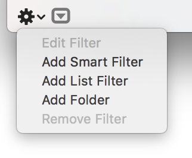

Google Fonts 2016 Glyph Sets
====================================================

Three levels of glyph sets were developed in June 2016 as a new baseline standard for fonts in the Google Fonts library. 
Exising fonts in the library can be upgraded to these as part of a drive towards new quality standards. 
All new fonts submitted to the library must now support the Plus level as a minumum requirement.

Three sets are available in this directory: **Plus, Pro and Expert.**

### Glyphs App Tip

Inside **FilterLists** are text files with a list of glyphs for each set. 
Open Glyphs and in the left bottom sidebar, create a new list filter, and paste the contents of these files to check if your fonts supports these characters. A ✓ will indicate you are all set. Otherwise **ctrl + click** on the numbers to generate missing glyphs.

 

Latin
----------------------------------------------------

Structure and Hierarchy of Encodings for Latin:

1. **Core** A Basic Latin set for Western Europe
2. **Plus** For all fonts in the library, a Extended Latin with wide language support (Central and Eastern European languages and Vietnamese)
3. **Pro** For casual and headline fonts that need a little more typographic sophistication, an extra 171 glyphs
4. **Expert** For text and workhorse typefaces that must supply everything typographers need, such as small caps, an additional 300 glyphs

### Google Latin Plus (584 glyphs total)

Vietnamese language support

Includes characters from the following unicode ranges: 

  - Latin-1
  - Latin Extended A 
  - Latin Extended B
  - Latin Extended Additional
  - Latin-1 Supplement

**Language support for the following Latin-based languages**: Abenaki, Afaan Oromo, Afar, Afrikaans, Albanian, Alsatian, Amis, Anuta, Aragonese, Aranese, Aromanian, Arrernte, Arvanitic (Latin), Asturian, Atayal, Aymara, Azerbaijani, Bashkir (Latin), Basque, Belarusian (Latin), Bemba, Bikol, Bislama, Bosnian, Breton, Cape Verdean Creole, Catalan, Cebuano, Chamorro, Chavacano, Chichewa, Chickasaw, Cimbrian, Cofán, Cornish, Corsican, Creek, Crimean Tatar (Latin), Croatian, Czech, Danish, Dawan, Delaware, Dholuo, Drehu, Dutch, English, Esperanto, Estonian, Faroese, Fijian, Filipino, Finnish, Folkspraak, French, Frisian, Friulian, Gagauz (Latin), Galician, Ganda, Genoese, German, Gikuyu, Gooniyandi, Greenlandic (Kalaallisut), Guadeloupean Creole, Gwich’in, Haitian Creole, Hän, Hawaiian, Hiligaynon, Hopi, Hotcąk (Latin), Hungarian, Icelandic, Ido, Igbo, Ilocano, Indonesian, Interglossa, Interlingua, Irish, Istro-Romanian, Italian, Jamaican, Javanese (Latin), Jèrriais, Kaingang, Kala Lagaw Ya, Kapampangan (Latin), Kaqchikel, Karakalpak (Latin), Karelian (Latin), Kashubian, Kikongo, Kinyarwanda, Kiribati, Kirundi, Klingon, Kurdish (Latin), Ladin, Latin, Latino sine Flexione, Latvian, Lithuanian, Lojban, Lombard, Low Saxon, Luxembourgish, Maasai, Makhuwa, Malay, Maltese, Manx, Māori, Marquesan, Megleno-Romanian, Meriam Mir, Mirandese, Mohawk, Moldovan, Montagnais, Montenegrin, Murrinh-Patha, Nagamese Creole, Nahuatl, Ndebele, Neapolitan, Ngiyambaa, Niuean, Noongar, Norwegian, Novial, Occidental, Occitan, Old Icelandic, Old Norse, Onĕipŏt, Oshiwambo, Ossetian (Latin), Palauan, Papiamento, Piedmontese, Polish, Portuguese, Potawatomi, Q’eqchi’, Quechua, Rarotongan, Romanian, Romansh, Rotokas, Sami (Inari Sami), Sami (Lule Sami), Sami (Northern Sami), Sami (Southern Sami), Samoan, Sango, Saramaccan, Sardinian, Scottish Gaelic, Serbian (Latin), Seri, Seychellois Creole, Shawnee, Shona, Sicilian, Silesian, Slovak, Slovenian, Slovio (Latin), Somali, Sorbian (Lower Sorbian), Sorbian (Upper Sorbian), Sotho (Northern), Sotho (Southern), Spanish, Sranan, Sundanese (Latin), Swahili, Swazi, Swedish, Tagalog, Tahitian, Tetum, Tok Pisin, Tokelauan, Tongan, Tshiluba, Tsonga, Tswana, Tumbuka, Turkish, Turkmen (Latin), Tuvaluan, Tzotzil, Uzbek (Latin), Venetian, Vepsian, Volapük, Võro, Wallisian, Walloon, Waray-Waray, Warlpiri, Wayuu, Welsh, Wik-Mungkan, Wiradjuri, Wolof, Xavante, Xhosa, Yapese, Yindjibarndi, Zapotec, Zarma, Zazaki, Zulu, Zuni

### Google Latin Pro (+171 for 755 glyphs total)

- Math symbols and units of measure ∆, Ω, π, ℓ, ℮, ∞, ∂, ∫, √, ∑, ∏, ◊
- Latin general use extensions from U+1E08 to U+1EC9
- Currencies ₡ ₣ ₤ ₦ ₧ ₩ ₫ ₭ ₱ ₲ ₵ ₹ ₺ ₼ ₽ 

### Google Latin Expert (+300 for 1055 total)

- Small Caps (.sc)
- Arrows and ornaments ← ↑ → ↓ ■ ▲ △ ▶ ▷ ▼ ▽ ◀ ◁ ◆
- Fractions ⅓, ⅔, ⅛, ⅜, ⅝, ⅞
- Superscript and Subscript ⁰¹²³⁴⁵⁶⁷⁸⁹₀₁₂₃₄₅₆₇₈₉

* * * 

Cyrillic
----------------------------------------------------

Structure and Hierarchy of Encodings for Cyrillic:

1. **Core** is the existing default set, a Basic Cyrillic
3. **Plus** includes added language coverage for Slavic, Non-Slavic, and Uralic languages, and Extended Cyrillic
3. **Pro** for Headline typefaces, with language support for historic Cyrillic and some Non-Slavic languages
4. **Expert** for text and workhorse typefaces, includes Small Caps

### Google Cyrillic Core

**Supports the following Cyrillic languages**: Balkar, Belarusian (Cyrillic), Bosnian (Cyrillic), Bulgarian, Croatian (Cyrillic), Erzya, Karachay, Kumyk, Macedonian, Moksha, Montenigrin, Nanai, Nogai, Russian, Rusyn, Serbian (Cyrillic), Ukrainian.

### Google Cyrillic Plus [246 total]

**Supports the following Cyrillic languages**: Abkhaz, Adyghe, Agul, Altay, Avar, Azerbaijani (Cyrillic), Balkar, Bashkir, Belarusian (Cyrillic), Bosnian (Cyrillic), Bulgarian, Buryat, Chechen, Chuvash, Crimean Tatar (Cyrillic), Croatian (Cyrillic), Dargin, Dungan, Erzya, Gagauz (Cyrillic), Ingush, Kabardian, Kalmyk, Karachay, Karakalpak, Kazakh, Khakas (Cyrillic), Khinalugh, Komi, Kumyk, Kurdish (Cyrillic), Kyrgyz (Cyrillic), Lak, Lezgian, Macedonian, Mari (Hill and Meadow), Moksha, Moldovan (Cyrillic), Mongolian (Cyrillic), Montenigrin, Nanai, Nogai, Ossetian, Russian, Rusyn, Rutul, Sakha/Yakut, Serbian (Cyrillic), Tabasaran, Tajik, Talysh (Cyrillic), Tat, Tatar, Turkmen, Tuvan, Udi, Udmurt, Ukrainian, Uyghur (Cyrillic), Uzbek (Cyrillic), Yukaghir (Northern and Southern).

Includes currencies: ₮, ₴, ₸.

The ruble sign (₽ U+20BD) is not included, since it is already present in the Latin Plus set.

### Google Cyrillic Pro (total: 322 glyphs, 76 unique glyphs)

Additional characters in this set provide support for the following languages: Chukchi, Enets, Itelmen, Nenets, Orok, Kanty, Kildin Sami, Tati

**Full list of supported Cyrillic languages**: Abkhaz, Agul, Altay Enets, Azerbaijani (Cyrillic), Balkar Adyghe, Bashkir, Belarusian (Cyrillic), Bosnian (Cyrillic) , Bulgarian Avar, Chukchi, Croatian (Cyrillic) , Dungan, Erzya Buryat, Gagauz (Cyrillic) , Ingush, Itelmen, Kabardian, Kalmyk, Kanty, Karachay Chechen, Karakalpak, Kazakh, Khakas (Cyrillic) , Khinalugh, Kildin , Komi, Kumyk Chuvash, Kurdish (Cyrillic) , Kyrgyz (Cyrillic), Lak, Lezgian, Macedonian Crimean Tatar (Cyrillic), Mari (Hill and Meadow) , Moksha Dargin, Moldovan (Cyrillic), Mongolian (Cyrillic), Montenigrin , Nanai , Nenets, Nogai , Orok, Ossetian, Russian , Rusyn , Rutul, Sakha/Yakut , Sami, Serbian (Cyrillic) , Tabasaran, Tajik, Talysh (Cyrillic), Tat, Tatar, Tati, Turkmen, Tuvan, Udi, Udmurt, Ukrainian , Uyghur (Cyrillic), Uzbek (Cyrillic), Yukaghir (Northern and Southern).

### Google Cyrillic Expert (+116 glyph, 438 total)

Includes additional characters and features:

- Small Caps (.sc)

### Acknowledgements:

Dave Crossland, Frank Grießhammer, Georg Seifert, Gunnar Vilhjálmsson, Jacques Le Bailly, Kalapi Gajjar, Nhung Nguyen, Pablo Impallari (Impallari Encoding), Thomas Jockin, Thomas Phinney (Adobe Cyrillic lists), Underware (Latin Plus Encoding)

Encoding created by Alexei Vanyashin 2016-07-27
